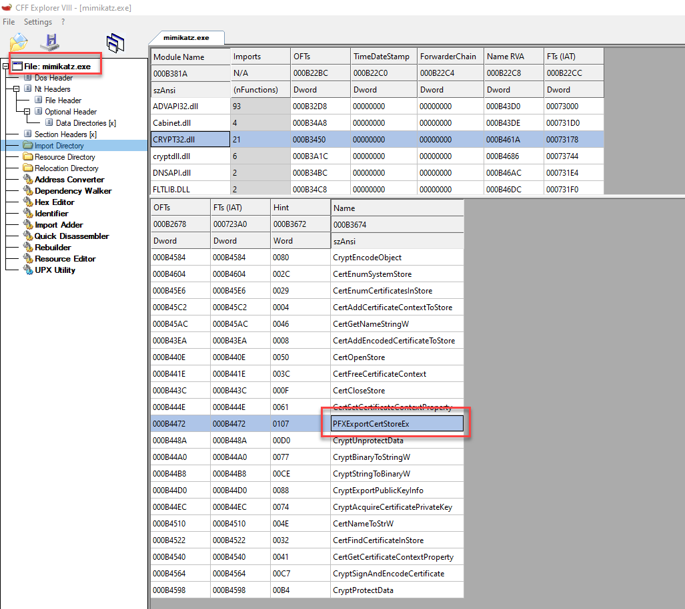
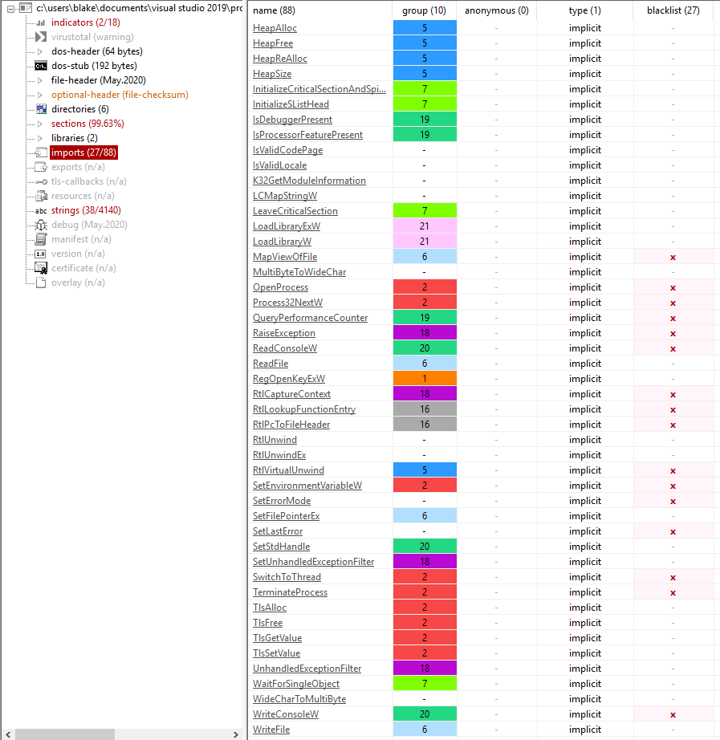
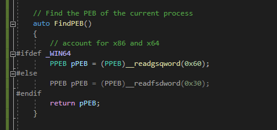

# API Obfuscation

## Slide 1

Function Obfuscation

Dynamically resolving functions

## Slide 2

Agenda

Why obfuscate functions
Runtime Linking
API Hashing
(whatever that technique is to point to a benign function)

## Slide 3

Why Obfuscate Function Calls

An analyst (or security product) can look at the Import Address Table (IAT) to get a list of functions used in the malware
The functions provide insight into the actions and overall goals of the code
Common for malware to obfuscate or use additional techniques to prevent entries in the IAT in order to slow down static analysis

## Slide 4

Import Address Table Example

Viewing the IAT provides insights into Mimikatz’s functionality to export certificates

## Slide 5

PeStudio

PeStudio, and similar tools, will flag suspicious functions based on the IAT

## Slide 6

Types of Linking

Static linking
All code from a library is copied into the resulting binary
Increased file size of final binary
Dynamic linking
Searches for and loads libraries required when program loads or starts
Information required about libraries is included in the PE header
Follows the standard windows search order process
Runtime linking
Load functions from libraries only when the function is needed
Useful for preventing entries in the Import Address Table (IAT)

## Slide 7

Runtime Linking Function Prototype

Define the prototype for the function you want to use
Example: using WriteProcessMemoryPrototype = BOOL(WINAPI\*)(HANDLE, LPVOID, LPCVOID, SIZE\_T, SIZE\_T)

## Slide 8

Runtime Linking Obtaining a Handle 

Get a handle to the library that contains the function you want to load
LoadLibrary or GetModuleHandle are typically used
HANDLE hDLL = ::LoadLibrary(LPWSTR(L“kernel32.dll”));
if (hDLL == NULL)
{
std::wcout << “LoadLibrary failed” << std::endl;
return hDLL;
}
return hDLL;

**Speaker Notes:** LoadLibrary will load a DLL from the filesystem whereas GetModuleHandle is used to find a DLL already loaded into the process. Both return the base address.

## Slide 9

Runtime Linking Steps - Resolving the address

Get the address of the function using GetProcAddress or similar function
Example:
WriteProcessMemoryProtoype WriteProcessMemory = (WriteProcessMemoryPrototype)(::GetProcAddress(hModuleHandle, LPCSTR("WriteProcessMemory")));
Call the function:
WriteProcessMemory(hProcess, memory, &scode, sizeof(scode), NULL)

## Slide 10

Run Time Linking Results

Analysis with PeStudio before applying runtime linking for thread hijacking

## Slide 11

Run Time Linking Results

Analysis using PeStudio after applying runtime linking 

## Slide 12

API Hashing

Another technique to obfuscate the actual functionality of the malware by preventing entries in the IAT
High level overview:
Create a hash of the API/function name using a technique of the author’s choice
Load or get a handle to the DLL containing the API/function
Iterate through the Export Address Table (EAT), hash each function, then compare
Return the virtual address of the function when found
Commonly seen across malware samples/families including Lokibot, Dridex, REvil, Zloader, PlugX, PoisonIvy, Carbanak ....

## Slide 13

API Hashing Example

Example hashing function using FNV and addition

**Speaker Notes:** The screenshot shows a function to calculate the hash of a string, which in this case would be the API name found in the EAT. FNV is used followed by the addition of a number, but this could be replaced by whatever algorithm the malware author would like to use.

## Slide 14

API Hashing Example (continued)

Example of reading the EAT

**Speaker Notes:** The screenshot shows code to get the base address of the DLL passed as the first argument to the function, find the EAT, and then get the relevant addresses. Note, the code is based off the blog post at https://www.ired.team/offensive-security/defense-evasion/windows-api-hashing-in-malware

## Slide 15

API Hashing Example (continued)

Example of searching for the target hash

**Speaker Notes:** The code then loops through the APIs, calculates their hash, and checks for a match (second argument passed to the function). If a match is found, the address of the function is returned so it may be called.

## Slide 16

API Hashing Example (continued)

Example of calling the API hashing functionality shown on previous slides

**Speaker Notes:** Example of searching for and using the MessageBoxA API using the code from the previous slides.

## Slide 17

API Hashing Code Issue

The issue with the proceeding code is still the call to LoadLibrary
This can be solved by the following:
Find the Process Environment Block (PEB)
Use the PEB to locate the InLoadOrderModuleList
Search the InLoadOrderModuleList for Kernel32
Iterate through the EAT of Kernel32 until we find a match for LoadLibraryW (or LoadLibraryA)

## Slide 18

API Hashing Code Improved

Finding the PEB and base address for Kernel32.dll

## Slide 19

Imphash

The ordering of the entries in the IAT can be used to tie together samples
When compiling the malware, the linker will generate the IAT based on the ordering of the functions used within the source
Analyst can create a hash based on the APIs used and their ordering, which is known as the Imphash
If a malware author changes the code but the ordering is not changed, the imphash may still allow an analyst to track and identify
Removing the imports through the use of runtime linking or API hashing can help evade imphashing
Inserting benign API/functions in the code could also be used to change the imphash

**Speaker Notes:** References:
https://www.fireeye.com/blog/threat-research/2014/01/tracking-malware-import-hashing.html
https://malcomvetter.medium.com/defeating-imphash-fb7cf0183ac

## Slide 20

API Hashing Code Improved

Using the returned address for LoadLibrary to load DLLs

## Slide 21

Call Obfuscation

T

**Speaker Notes:** References:
https://www.fireeye.com/blog/threat-research/2014/01/tracking-malware-import-hashing.html
https://malcomvetter.medium.com/defeating-imphash-fb7cf0183ac

## Slide 22

Lab

S

