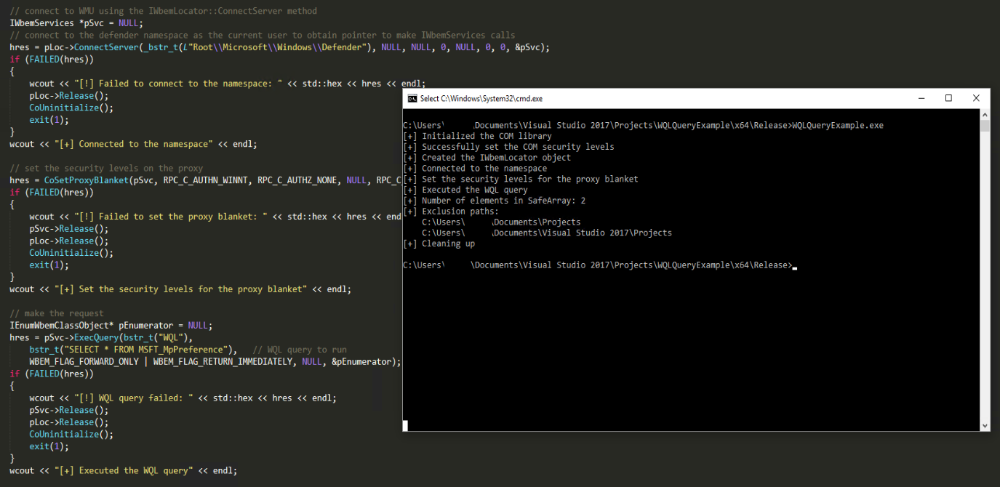
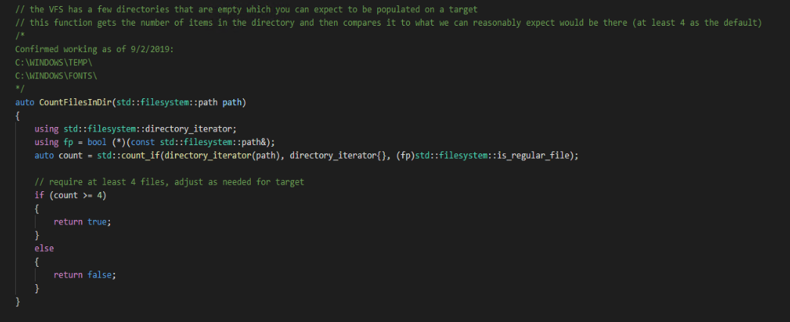

# AV_EDR Evasion

## Slide 1

AV/EDR Evasion

## Slide 2

Agenda

Bypassing traditional AV
Windows Defender bypasses
Bypassing EDR
Cylance bypasses

## Slide 3

Understanding the Enemy

Minifilter / kernel driver to intercept calls from userland to kernel mode
Process monitoring - PsSetCreateProcessNotifyRoutineEx
Thread monitoring - PsSetCreateThreadNotifyRoutine
File type - PsSetLoadImageNotifyRoutine
File Scanning - registers a minifilter for callbacks on R/RW operations on the filesystem
Registry - CmRegisterCallback

## Slide 4

Understanding the Enemy

AV Analysis Engine
Unpackers
Signature scanning
Sandbox
Heuristics
EDR
Behavioral monitoring (commonly a DLL)

## Slide 5

Self Protection Mechanisms

Protection from the user/malware stopping, disabling or tampering with components
Minifilter to prevent changes to core components on the file system and registry
ACLs / ObRegisterCallbacks to protect the service
The ProcessNotifyRoutine is often used to gather details and assign a level of trust to the process if it is the AV/EDRs own whitelisted process

## Slide 6

Traditional AV Bypasses

Signatures
Find the exact byte by splitting the file into small chunks and scanning
Once the signature is found, modify, obfuscate, or encrypt the section of code
Scanning
Inflate the file size
Identify excluded process names and folders
This information can often be found in the registry, GPOs, querying WMI or in memory

**Speaker Notes:** There is often a limit to the file size in order to prevent a performance hit for the user when scanning

## Slide 7

Traditional AV Bypasses

McAfee HKLM\SOFTWARE\Wow6432Node\McAfee\SystemCore\vscore\On Access Scanner\McShield\Configuration\Default
Windows Defender via WMI

**Speaker Notes:** 

## Slide 8

Windows Defender Dynamic Emulation Bypasses

Windows Defender implements a Virtual File System in which it runs samples
The VFS is static and is often not reflective of the target
World of Warcraft registry keys
Empty Windows directories
IRC related files on the filesystem
Check for the presence of these items and do nothing or a benign activity
References: https://i.blackhat.com/us-18/Thu-August-9/us-18-Bulazel-Windows-Offender-Reverse-Engineering-Windows-Defenders-Antivirus-Emulator.pdf

**Speaker Notes:** Defender as a use case here but this applies to several other products as well. 
Often, functions are not completely implemented or hardcoded to return a static value, which can be used to fingerprint or bypass the emulation engine. For example, the CIA documented that some engines would always return FLS_OUT_OF_INDEXES when the FlsAlloc function is called.  
Additionally, calling OpenProcess on the PID of 4 (System process from session 0) should fail but this was not properly implemented on a few engines and would return success.
Other historical bypasses:
Network traffic - when attempting to download a non-existent file the engine would return something random. Likewise, hardcoded user agent strings or responses may be used
Emulation - instructions which behave differently on an emulated CPU
Timing - time skews or inconsistencies
Environment - harcdoded strings, files/registry entries/processes not present on the target or missing from the emulation environment

## Slide 9

Windows Defender Dynamic Emulation Bypasses

**Speaker Notes:** 

## Slide 10

Windows Defender Dynamic Emulation Bypasses

Alternatively, leverage environmental keying
Information on tools, logs from admins, forum posts, email headers, etc. can all reveal information about the endpoint, domain or network
Ensure your code will only be executed if those items are present
The Gauss malware uses environmental variables and expected system configurations as the decryption key, which to this day has not been broken

**Speaker Notes:** 

## Slide 11

Windows Defender Timing

Tradeoff on how long AV can dedicate to analysis versus executing the program
Use this to our advantage to create a delay that bypasses the heuristic engine
Time delays are often emulated so need to perform an action that cannot be “speed up”
Examples: allocate memory, hashing a string, math computations

## Slide 12

Windows Defender Timing

Allocating and deallocating memory to create a delay
Note the sleep statement to prevent 100% CPU usage
auto AllocateMemory()
{
for (int i = 0; i < 50; i = i + 1)
{
char\* Memdmp = NULL;
Memdmp = (char\*)malloc(110000000);
if (Memdmp != NULL) {
memset(Memdmp, 00, 110000000);
free(Memdmp);
}
Sleep(150); // try and prevent high CPU usage
}
}

## Slide 13

Cylance Evasion

## Slide 14

Overview

Cylance capabilities
Tampering with Cylance’s components
Abusing intentional weaknesses
Unhooking specific functions
Mapping a clean DLL

## Slide 15

Cylance

Talk about optics vs memory defense
Talk about how it works
Talk about AI

## Slide 16

Kernel Callbacks

Callbacks …..
Enumerating callbacks
Removing callbacks
Driver signing

