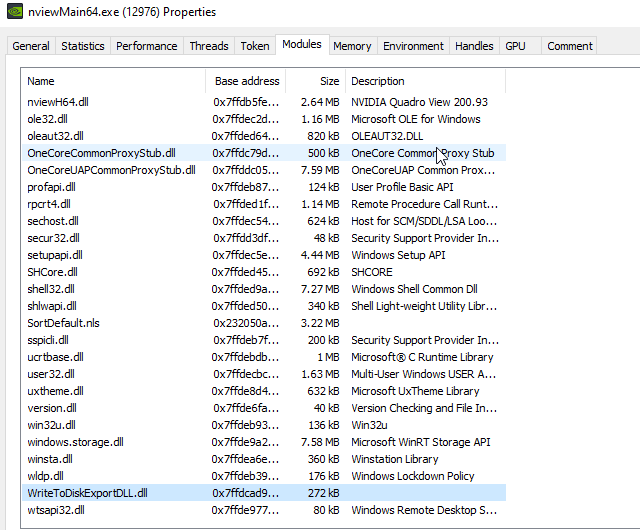
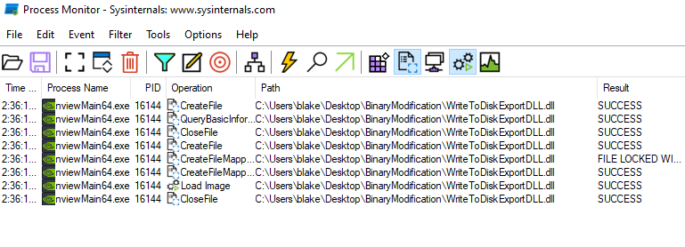
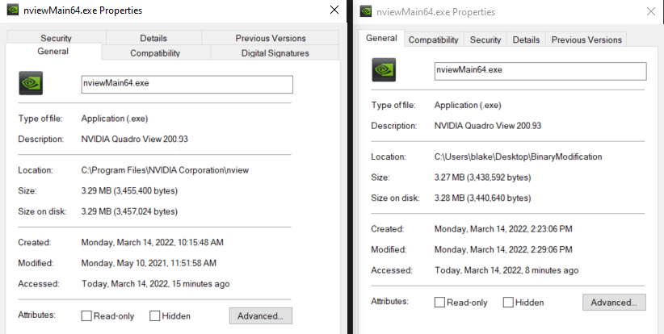

# Binary Modifications

## Slide 1

Binary Modifications

## Slide 2

Agenda

What is binary modifications
Modifying the Import Address Table
Lab

## Slide 3

What is binary modifications

## Slide 4

Modifying the Import Address Table 

Technique used by APT41
A malicious import is added to a legit Windows binary
When the binary is executed, the import is loaded and the entry point called

**Speaker Notes:** Reference: https://www.mandiant.com/resources/apt41-us-state-governments

## Slide 5

Modifying the Import Address Table 

Create a DLL with an exported function

## Slide 6

Modifying the Import Address Table 

Use COFF Explorer to add a new entry into the IAT for the malicious DLL

**Speaker Notes:** Select Add and chose the DLL created
Select the exported function and chose the Import By Name option
Rebuild the Import Table

## Slide 7

Modifying the Import Address Table 

Running the binary will cause the DLL to be loaded

## Slide 8

Modifying the Import Address Table 

This process does invalid the digital signature (if present), the modified, accessed, and created attributes are changed, and the file size is affected

## Slide 9

Exercise

Placeholder

