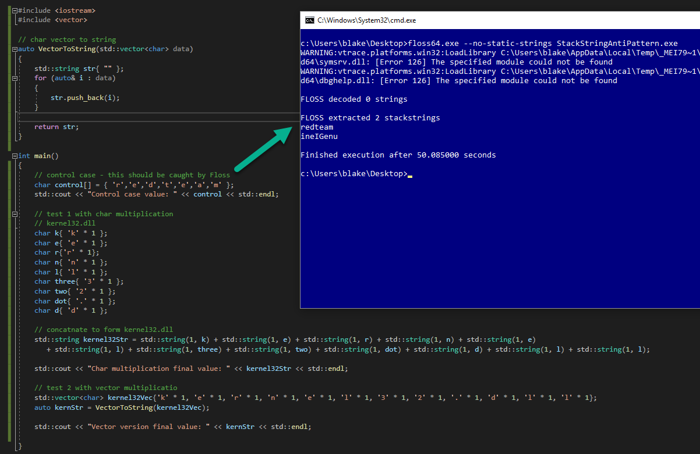

# Common Malware Functionality

## Slide 1

Malware Functionality

Developing common techniques and capabilities

## Slide 2

Agenda

Hiding console windows
Preventing error messages
Embedding / Extracting resources
Stack Strings
Hashing

## Slide 3

Hiding console windows - ShowWindow 

The ShowWindow function can be used to hide a specified window
Pass a handle to the window to be hidden and the flag SW\_HIDE
To obtain a handle to the current process, GetConsoleWindow may be used
Note, the console windows may briefly appear before being hidden depending on how the program is structured and how long the function execution takes
Example:
HWND hWnd = GetConsoleWindow();
ShowWindow(hWnd, SW\_HIDE);

## Slide 4

Hiding console windows - Windows Subsystem

The Subsystem can also be set to Windows to prevent a windows from appearing
This is typically prefered over the ShowWindow method
Change the int Main() statement to: int CALLBACK WinMain(HINSTANCE hInstance, HINSTANCE hPrevInstance, LPSTR lpCmdLine, int nCmdShow)
Under solution properties, Linker -> System and change Subsystem to Windows (/SUBSYSTEM:WINDOWS)

## Slide 5

Preventing Error Messages

The following can be used to prevent messages being display to the user in the event the program encounters an error
It will also prevent the messages from being logged in the Application event log
SetErrorMode(SEM\_NOGPFAULTERRORBOX | SEM\_FAILCRITICALERRORS | SEM\_NOALIGNMENTFAULTEXCEPT | SEM\_NOOPENFILEERRORBOX);

## Slide 6

Embedding Resources

Files can be embedded within executables as resources
Often used by malware authors to perform tasks such as extracting configuration files, additional executables, or reading shellcode
In VS, resources can be added by right clicking on the Resource Files folder, selecting Add, then selecting Existing Item
The Import option is then used to browse to the file to be included
Name the included file (you will reference the file by this name in the code) and select OK

## Slide 7

Embedding Resources

## Slide 8

Extracting Resources

Common functions used for extraction:
FindResource
LoadResource
LockResource
SizeofResource
CreateFile (if dropping to disk)
CreateFileMapping (if dropping to disk)
MapViewofFile (if dropping to disk)
UnmapViewofFile (if dropping to disk)

## Slide 9

Extracting Resources - Code Sample

Find the embedded Resource with FindResource
hResource = FindResource(nullptr, MAKEINTRESOURCE(resourceID), resourceName.c\_str());
Get a handle to the resource
hFileResource = LoadResource(nullptr, hResource);
Get a pointer to the resource in memory
void\* lpFile = LockResource(hFileResource);
Get the size
resourceSize = SizeofResource(nullptr, hResource);
Perform whatever action that fits the objective (e.g. shellcode injection, dropping to disk, etc.)

## Slide 10

Stack Strings

Malware commonly pushes the characters needed on to the stack in order to form the string required
This is done to avoid the discovery of the strings when analyzing the binary statically using malware analysis tools
The string is then created during execution
Example code:
std::vector loadLibraryVector({ 'L', 'o', 'a', 'd', 'L', 'i', 'b', 'r', 'a', 'r', 'y' });
std::string loadLibrary(loadLibraryVector.begin(), loadLibraryVector.end());

## Slide 11

Stack Strings

The strings are pushed onto the stack individually

## Slide 12

Stack Strings

Note the LoadLibrary string is not present

## Slide 13

Stack Strings - PowerShell Script

Simple powershell script to create a stack string
param ([Parameter(Mandatory)]$string)
[string]$stackString = ""
$charArray = ([char[]]$string)
$stackString = $charArray | ForEach-Object {"L`"" + $\_ + "`","}
$stackString = $stackString.Substring(0,$stackString.Length-1)
write-host $stackString

## Slide 14

Stack Strings - Preventing Automated Extraction

Malware analysis tools exists to identify the pattern commonly associated with stack strings (e.g. mov [ebp + var\_4], 'k')
To break this pattern, perform instructions that do not change the final value
For example: char k = {‘k’ \* 1}

## Slide 15

Stack Strings - Preventing Automated Extraction

The stack string created without the anti-pattern behavior is discovered by Floss, however the two use cases using the x \* 1 pattern remain undetected

## Slide 16

Adjusting the PowerShell Script

 param ([Parameter(Mandatory)][string]$string)
[string]$stackString = ""
$charArray = ([char[]]$string)
$stackString = $charArray | ForEach-Object {"L`'" + $\_ + "`' \* 1,"}
$stackString = $stackString.Substring(0,$stackString.Length-1)
write-host $stackString

## Slide 17

Hashing

Hashing can be used as an alternative to strings and to slow down analysis
Common hashing methods: CRC32, MD5, SHA1
Examples of malware utilizing hashing:
Gootkit performs a check of its own filename and compares to a hardcoded list of CRC hashes filenames. If a match is found, it deletes the executable
Common for shellcode to use CRC32 checksums to locate APIs
Dridex creates a unique “identifier” for infected systems by concatenating information such as the computer name, username and install date, then MD5 hashing the information
FIN8 calls GetVolumeInformation to get the hard disk name and then SHA1 hashes the result. A comparison is then made to check if the malware should run on the system

## Slide 18

Example CRC32 Checksum Code

The following function generates a lookup table for the checksum of all 8-bit values (code from https://rosettacode.org/wiki/CRC-32)

## Slide 19

Example CRC32 Checksum Code

This following function generates the CRC32 checksum and returns the results (code from https://rosettacode.org/wiki/CRC-32)

## Slide 20

Example CRC32 Checksum Code

Example environment variable check on the computer name using the CRC32 class

