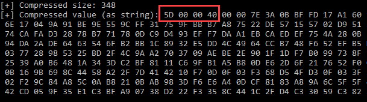
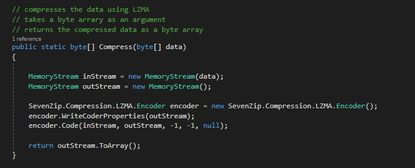
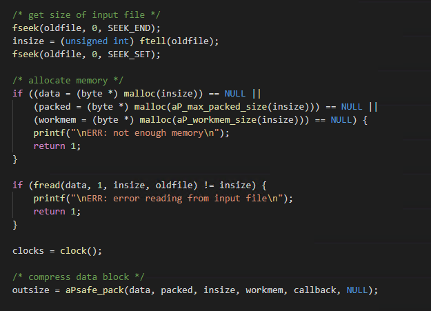

# Compression

## Slide 1

Compression

Insert subtitle

## Slide 2

Agenda

What is compression
Zlib
LZW
LZMA
LZNT1
APLIB
Lab

## Slide 3

Why use compression

Compression in malware may be used for a variety of purposes
Obfuscate data
Evade signature based detections
Slow down the reversing process
Meet the operational requirements (e.g. reduce file size for delivery)

## Slide 4

zlib

Abstraction of the DEFLATE compression algorithm
DEFLATE is a combination of LZ77 and Huffman coding
The algorithm used in the zip archive format
No limit to the length of data that can be compressed or decompressed
zlib can be recognized by the header
The first byte is the Compression Method and Flags, which is often 0x78
The second byte usually signifies the level of compression
0xDA - best compression, 0x9C - default compression
Used by the lookback malware to obfuscate its configuration file and in command and control communications (C2)
C2 communications over 4kb are compressed using zlib in the PipeMon malware

**Speaker Notes:** Reference: https://www.proofpoint.com/us/blog/threat-insight/ta410-group-behind-lookback-attacks-against-us-utilities-sector-returns-new
Reference: https://www.welivesecurity.com/2020/05/21/no-game-over-winnti-group/

## Slide 5

zlib

Example of compressing a string using zlib from zlib.net

**Speaker Notes:** Add reference to GhostRat/other malware and how they utilize Zlib

## Slide 6

LZW

Lempel-Ziv-Welch (LZW)
Dictionary based compression algorithm
Reads data and creates an entry in a dictionary for repeating pattern
As data is read, patterns previously seen are substituted with the representation of that pattern and new patterns added to the dictionary
Part of the GIF format and commonly used in TIFF and PDF
Can be used on any type of file, but performs best on file types with high numbers of repeating patterns, such as text
LZW contains a magic header value of 1F 9D
The PcShareDropper malware contains the PcShare loader as a resource, which is stored XOR’d and then LZW compressed

**Speaker Notes:** Reference to example malware: https://www.bitdefender.com/files/News/CaseStudies/study/379/Bitdefender-Whitepaper-Chinese-APT.pdf

## Slide 7

LZW

Compressing a powershell command with LZW

**Speaker Notes:** C++ code example of compressing a string using LZW

## Slide 8

LZMA

Lempel-Ziv-Markov chain algorithm
Uses a dictionary compression scheme with a high compression ratio to perform lossless data compression
Used by 7-Zip as the default compression method for the 7z format
LZMA2 is a container that contains the uncompressed and LZMA compressed data
LZMA2 supports multithreaded compression/decompression
The OceanLotus group has used LZMA to decompress data stored as a resource and during C2 communications
Raindrop, used in the solarwinds breach, extracts encrypted shellcode and decompresses it using LZMA

**Speaker Notes:** OceanLotus reference: https://www.welivesecurity.com/wp-content/uploads/2018/03/ESET_OceanLotus.pdf
Raindrop reference: https://threatpost.com/solarwinds-malware-arsenal-raindrop/163153/

## Slide 9

LZMA Detection

LZMA compressed data often starts with the value 0x5D
The value at the third offset indicates with compression mode was used
Other variations on LZMA exist and the values will differ or may not be present

## Slide 10

LZMA

Example of compressing a byte array using the 7-Zip SDK in C#

**Speaker Notes:** Sample function for compressing data using the 7-Zip SDK’s implementation of LZMA

## Slide 11

LZMA

Example of decompression

**Speaker Notes:** Sample function for decompressing data using the 7-Zip SDK’s implementation of LZMA

## Slide 12

LZNT1

Compression….

## Slide 13

aPLib

Small, LZ based compression library
Used in Darkside’s ransomware to compress the configuration items and ransomware note
Detection of aPLib compression
Magic value of AP32 followed by the header size of 0x18 bytes
Payload for compressed executables starts with the value M8Z
Strings related to the author Jørgen Ibsen, aPLib or ibsensoftware
Reference: https://ibsensoftware.com/products\_aPLib.html

**Speaker Notes:** Reference: https://www.fireeye.com/blog/threat-research/2021/05/shining-a-light-on-darkside-ransomware-operations.html

## Slide 14

aPLib

Sample file compression code from appack.c

**Speaker Notes:** Sample code to compress a file from the appack.c file, which is available in the APLib download from https://ibsensoftware.com/download.html

## Slide 15

Case Study

Case study on some malware using compression

**Speaker Notes:** oad.html

## Slide 16

Lab

Compression….

