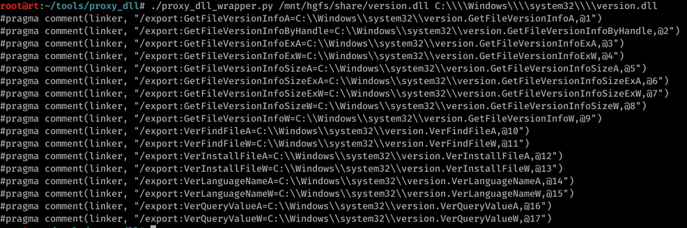
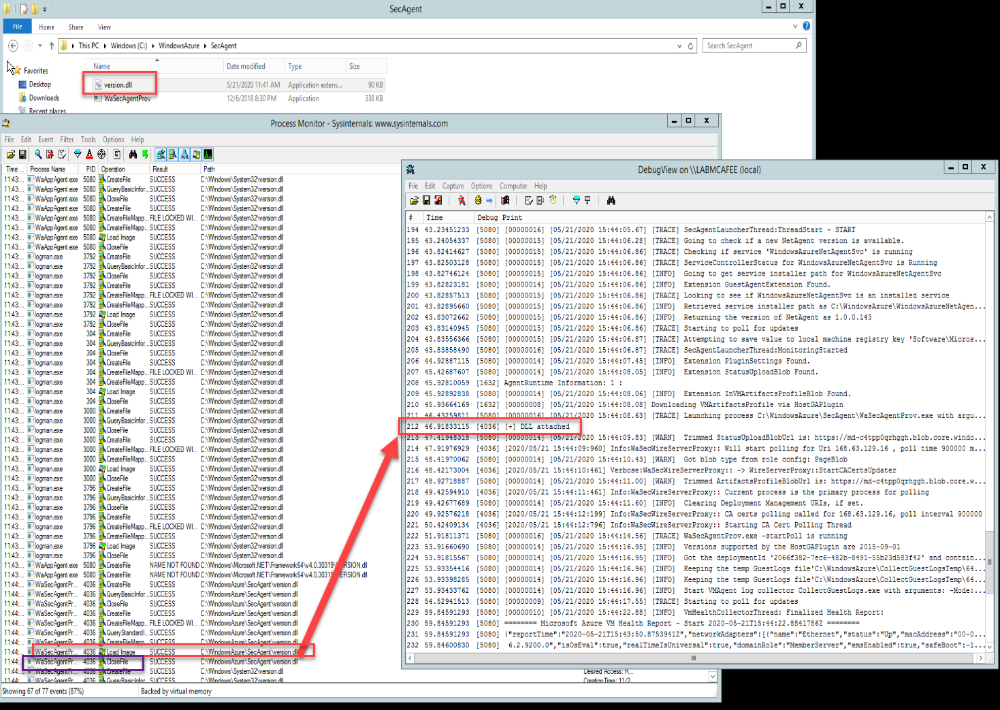
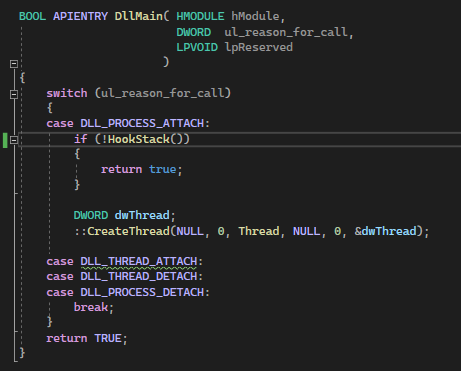
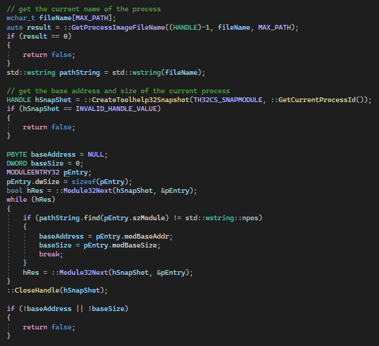
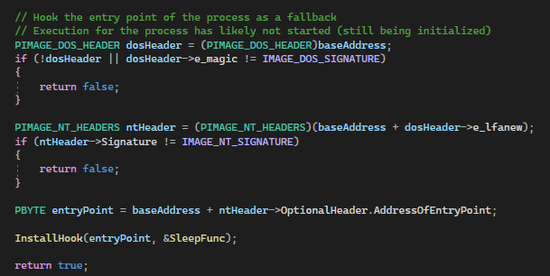
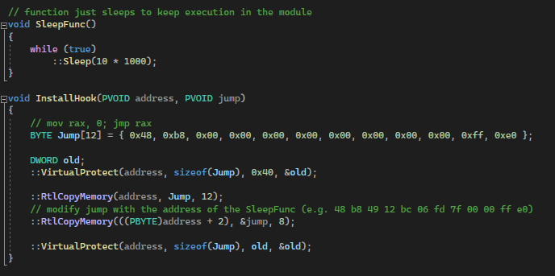

# DLL Hijacking

## Slide 1

 DLL Hijacking

## Slide 2

Overview

DLL Search Order
Finding vulnerable applications
Enumerating DLL details
Exports
Proxying functions
Appendix - Caveats

## Slide 3

DLL Search Order

The standard search order for a DLL is as follows when SafeDllSearchMode is enabled (default setting):
The directory from where the application is loaded
System directory
16-bit system directory
Windows directory
Current directory
Directories that are listed in the PATH environment variable
If the DLL is on the known DLL list, it will be loaded from the specified path (HKLM\System\CurrentControlSet\Control\Session Manager\KnownDLLs)
If we can plant a DLL along the search order, we may be able to get code execution under the context of the application

## Slide 4

Finding vulnerable applications

Procmon or similar tools can be used to find applications that attempt to load non-existent DLLs
Filter: Result is NAME NOT FOUND, Path contains .dll
Alternatively, if you are looking to sideload a DLL into a signed process for evasion, try copying the program to a non-standard directory and executing

## Slide 5

Enumerating Details

PE parsing tools can be used to view the exports of a DLL
This can help enumerate the information we need and validate any DLLs we may create match what is expected
Example of using COFF Explorer 

## Slide 6

Creating exports manually

DLL exports can be defined manually
Can be combined with hooking or other techniques to log parameters, alter the application flow, etc.
Creating a CreateXmlReader export in dllmain.cpp:
extern "C" \_\_declspec(dllexport) void \_\_cdecl CreateXmlReader();
\_\_declspec(dllexport) void \_\_cdecl CreateXmlReader()
{
// Do something
}

## Slide 7

Forwarding exports 

Forward exported functions to the real DLL to prevent breaking functionality
Simple python script leveraging pefile can be used to automate the process

## Slide 8

Forwarding exports 

Example output from executing the script

## Slide 9

Adding exports to DLL project

Create a DLL project in VS per normal
Create a new source file that matches the project name (name.cpp)
Paste the output from the python script into the file. Add the “pch.h” header
Ensure strings are properly escaped (e.g. C:\\Windows instead of C:\Windows)
Once compiled, confirm the exports are present

## Slide 10

Adding exports to DLL project

Adding the exported functions and viewing the compiled results

## Slide 11

Creating a proof of concept

Add in statements to output and a call to create a new thread 

## Slide 12

Initial testing

Test the DLL is loaded and application functionality does not break

## Slide 13

Other methods of proxying functions

Forwarding exports is not the only method that can be used
Stack Patching - walk the stack and replace return values with a different module handle for calls to LoadLibrary (CIA technique)
Link at runtime - create pointers in the export table and dynamically re-populate at runtime
Rebuild the export address table at runtime from the legit DLL

## Slide 14

Weaponizing the poc

Add functionality per normal within your threaded function
See the Appendix for caveats

## Slide 15

Hooking the Stack

Execution of the process/DLL may happen quick enough we do not have time to perform our desired action
Walk the stack and create a hook to take over primary execution
This may negatively affect the application and must be tested thoroughly
Reference: https://gist.github.com/monoxgas/5027de10caad036c864efb32533202ec

## Slide 16

Hooking the Stack Example

On process attach, the function is called to setup the hook

## Slide 17

Hooking the Stack Example

The current process name is found using GetProcessImageFileName
CreateToolhelp32Snapshot is used to find the base address and size of the current process

## Slide 18

Hooking the Stack Example

The address of LdrLoadDll is found
The return address of the current function is found using \_AddressOfReturnAddress
The boundaries of the stack are determined using GetCurrentThreadStackLimits
The stack is then searched for LdrLoadDll (DLL was likely loaded using LoadLibrary) and the hook set in the call stack
If the execution of the process has not been started, the entry point is hooked instead

## Slide 19

Hooking the Stack Example

## Slide 20

Hooking the Stack Example

The InstallHook junction writes a jump to the SleepFunc function on the stack
The SleepFunc uses an infinite loop to maintain execution in the DLL

## Slide 21

Hooking the Stack Example

Once the hook is set, call the function containing the payload

## Slide 22

Appendix: DLL Hijacking Caveats

## Slide 23

DllMain

Code execution is usually gained from DllMain
DllMain is called when the loader-lock is held
Our code is executing while a synchronization lock is occuring
Microsoft lists multiple items that should be avoided inside DllMain (e.g. LoadLibrary, CreateProcess, registry functions, etc) or a deadlock may occur
Reference: https://docs.microsoft.com/en-us/windows/win32/dlls/dynamic-link-library-best-practices

## Slide 24

DllMain

It is generally safe to create a new thread from DllMain to execute our functionality
Example: CreateThread(NULL, NULL, (LPTHREAD\_START\_ROUTINE)Start, NULL, NULL, NULL);

## Slide 25

Pre and Post Load Execution

We may gain code execution in one of two phases:
Pre-Load - the process is still be initialized and execution has not been fully redirected to the application (e.g. call to LdrpInitializeProcess)
Post-Load - the process has already started execution and our DLL may be loaded by a call to LoadLibrary / GetProcAddress

## Slide 26

Pre and Post Load Execution

DLLs loaded as part of a dependency will show up in the Import Address Table (IAT)
Common for a process to examine the Export Address Table (EAT) for a dependent DLL to ensure it provides the correct functionality before passing execution
In this case, ensure you recreate or forward exports as appropriate

