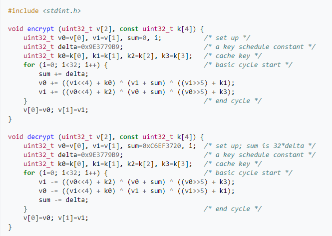
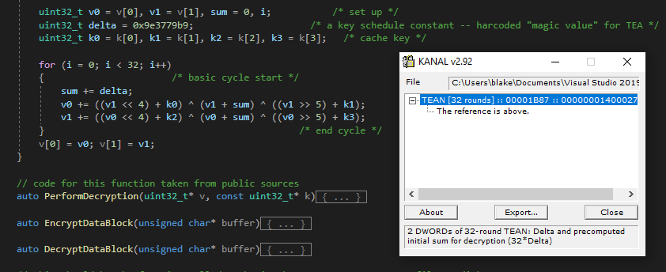
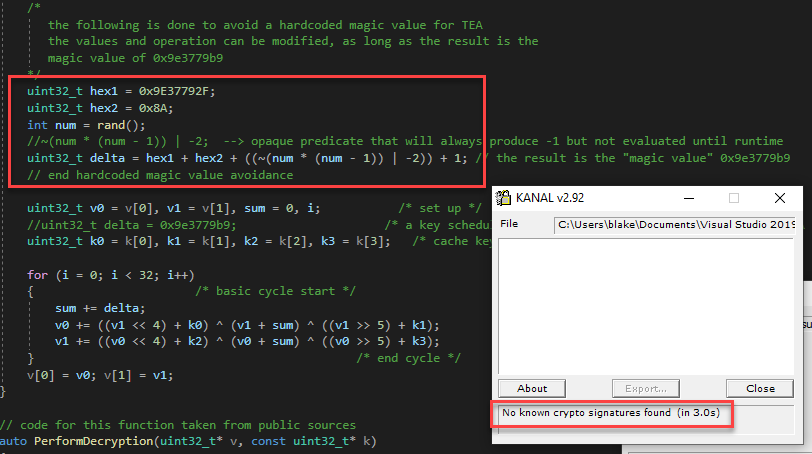

# Encryption

Agenda

- Why use encryption
- Encryption fundamentals
- Encryption using windows APIs
- AES
- RC4
- TEA
- MISTY1
- Avoiding magic values

## Why use encryption 

Encryption refers to the “transformation of data into a form that conceals the data’s original meaning to prevent it from being known or used” - NIST

Uses of encryption in malware include:
- Obfuscation of sensitive data
- Signature based evasion
- Slowing down the analysis process
- Render data inaccessible

## Encryption fundamentals 

- Symmetric algorithms use the same key for encryption and decryption
- Asymmetric algorithms use two keys, one for encryption and one for decryption
- In asymmetric, the two keys are referred to as the public key, which is shared, and the private key
- Encryption keys depend upon the algorithm being used, but tend to either be static or dynamically modified during execution

Reference: Mastering Malware Analysis by Alexey Kleymenov and Amr Thabet

## Encryption modes 

- CBC
- CFB
- OFB
….

Modes and if they add padding, etc

## Encryption using windows APIs 

- Microsoft offers two sets of APIs/functions that are used for encryption
- The legacy set is referred to as the CryptoAPI
- Cryptography API: Next Generation (CNG) is a replacement for CryptoAPI
- Common process flow for CNG
    - Open the algorithm provider using BCryptOpenAlgorithmProvider (providers are libraries for crypto)
    - Get or set any properties such as the key size or mode of operation with BCryptGetProperty and BCryptSetProperty
    - Create or Import a key (BCryptGenerateSymmetricKey, BCryptGenerateKeyPair, BCryptImportKey, BCryptImportKeyPair)
    - Encrypt or decrypt using BCryptEncrypt or BCryptDecrypt
    - Close the algorithm provider using BCryptCloseAlgorithmProvider
- CNG supports multiple symmetric, asymmetric, hashing and key exchange algorithms

## AES

- Advanced Encryption Standard (AES)
- Symmetric-key algorithm
- Fixed block size of 128 bits and a key size of either 128, 192 or 256 bits
- Approved standard for the US government by the National Institute of Standards and Technology (NIST)
- Chosen by NIST for performance on a variety of hardware and software components, ease of implementation and level of security provided
- Popular with malware authors
    - PyFlash (Turla) - Encrypt C2 traffic
    - MATA - Loader decrypts AES encrypted payload
    - ModPipe - Encrypt C2 traffic with AES in CBC mode
    - Phobos Ransomware - AES encryption of strings and other data
    - Cobalt Strike - Part of the tasking process (AES/HMAC)

## RC4

Add malware using AES

## TEA

- Tiny Encryption Algorithm (TEA)
- Designed to have a simple description and implementation
- Encrypts 64 bit blocks using a 128 bit key
- Suffers from equivalent keys, which means each key is equivalent to three others. This effectively reduces the key size to 126 bits
- TEA is vulnerable to related-key attacks
- To address the weaknesses, variations (XTEA and XXTEA) were developed
- TEA may be identified by the magic value 0x9e3779b9
- When using TEA to encrypt files/strings, keep in mind that it operates on 64 bit blocks (8 bytes) at a time. This means you will have to read in the file/string 8 bytes at a time and account for padding

Add malware using TEA

## TEA

Public domain code example of encryption and decryption using TEA

## MISTY1

- Block cipher developed for Mitsubishi Electric
- Operates on 64 bit blocks with a key size of 128 bits and a variable number of rounds
- Secure against differential and linear cryptanalysis
- Designed for performance on hardware platforms and software environments
- Used by Turla in their Outlook backdoor

*comeback

Malware using misty1 - add reference
Identifying the use of misty1

## Avoiding magic values

- Encryption algorithms often contain a “magic value”, which is a constant associated with the process
-A malware analyst can look for the constants in order to identify the algorithm
- Tools that automate the process include Krypto ANALyzer (KANAL) and FindCrypt2 (IDA Pro plug-in)
- By calculating the constant at execution, tools that search for the magic value may be bypassed
- Opaque predicates are useful to create a situation in which the outcome is known ahead of time but the expression still needs to be evaluated at execution
- Opaque predicates can be used as part of the calculation of the magic value

More on opaque predicates later

## Avoiding magic values

Using Krypto ANALyzer (KANAL) to detect the use of TEA

Malware using misty1
Identifying the use of misty1

## Avoiding magic values

An opaque predicate is used to calculate the value of the constant need. KANAL is no longer able to identify a crypto signature after the change

Malware using misty1
Identifying the use of misty1

