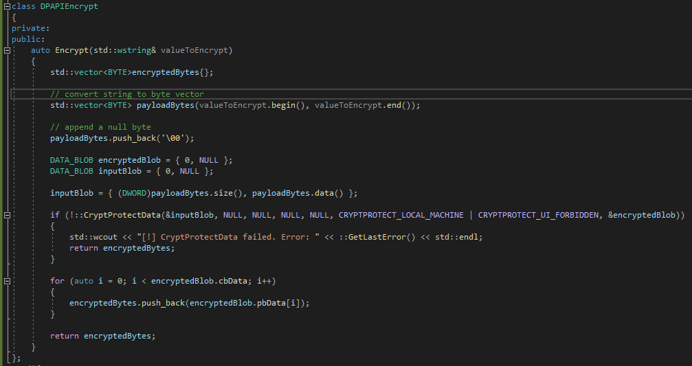
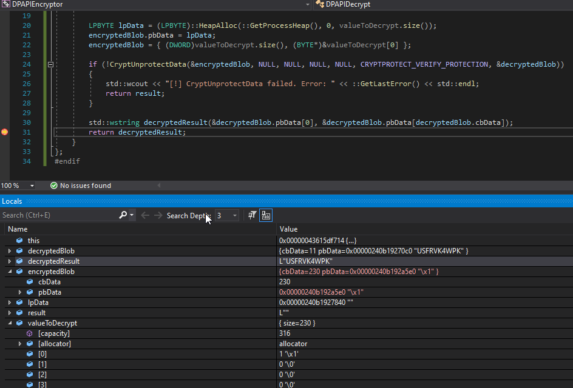

# Environmental Keying and Guardrails

## Slide 1

Environmental Keying and Guardrails

## Slide 2

Agenda

Why
DPAPI
Lab

## Slide 3

Why use environment keying and guardrails

En

## Slide 4

DPAPI

Used by the Invisimole group to prevent execution of payloads outside of the compromised system
Data Protection API (DPAPI) exposes two functions:
CryptProtectData which performs encryption on a DATA\_BLOB structure
CryptUnprotectData
Uses the logon credentials of the local machine or user, depending on the flags specified, to encrypt the data
Makes decryption outside of the compromised machine difficult as it requires knowledge of the machine/user credentials
Disadvantage is the requirement to perform the encryption on the compromised host or the compromise of the DPAPI key (see mimikatz)

**Speaker Notes:** DPAPI is used by Windows to protect WIFI credentials, in the remote desktop connection manager, and other areas. It has been used by third parties such as Chrome to protect cookies.

## Slide 5

DPAPI Encryption Example

## Slide 6

DPAPI Decryption Example

## Slide 7

DPAPI Example 

**Speaker Notes:** The hostname of the system is retrieved, dpapi encrypted, and the result is used later as a decryption key in a separate encryption algorithm. The screenshot on the left show the hostname being DPAPI encrypted and the screenshot on the right shows the decryption result

## Slide 8

TO DO:

Discuss “common” guardrails - domain, computer name, username, mac address, file paths/processes
Others: MBR, HW profile GUID, Machine GUID, SUS Client ID, System SKU, ETag

