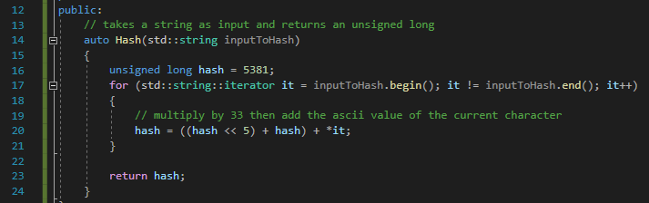
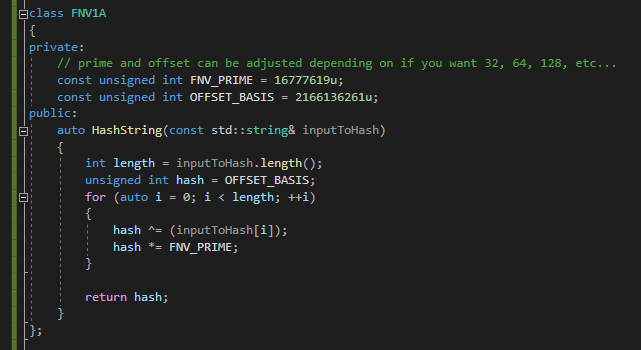

# Hashing

## Slide 1

Hashing

Insert subtitle

## Slide 2

Agenda

What is hashing
CRC32
DJB2
MD5
SHA
FNV-1 / FNV-1a
Case Study
Case Study
Lab

## Slide 3

What is hashing 

Hashing is the process of scrambling a piece of information or data beyond recognition. They are designed to be irreversible. We pass the input through a hash function to calculate the hash value or digest.

## Slide 4

CRC32

Cyclic Redundancy Check (CRC), 32 bit
CRC32 is often used for error checking

**Speaker Notes:** 

## Slide 5

DJB2

Original version written in 1991 to be a simple hashing function for strings
The hashing function begins by setting the hash variable to the number 5381
It then iterates each character, performing the following:
Multiply the hash variable by 33 using bit shifts (done for speed)
Adds the ASCII value of the character
A second variation of djb2 using xor is also commonly seen
hash(i) = hash(i - 1) \* 33 ^ str[i];
DJB2 can be detected through the use of the constant values 33 and 5381, although other limited values may be used
Malware usage…..

**Speaker Notes:** Add example malware using dbj2

## Slide 6

DJB2

Example djb2 hashing in C++

**Speaker Notes:** 

## Slide 7

MD5

Designed in 1991 by Ronald Rivest
One-way cryptographic hash function
128-bit digest size for every single input
Initially designed for digital signatures
MD5 is considered insecure due to cryptographic weaknesses

**Speaker Notes:** 

## Slide 8

SHA 

Secure Hash Algorithms (SHA)
SHA-1 is a cryptographic function which takes an input and produces a “message digest”, usually shown in hexadecimal format, of 160 bits
SHA-2 refers to SHA-256 and SHA-512, which use 256 and 512 bits to produce the message digest
SHA-3 uses a different internal structure than the previous SHA versions but still supports the same hash lengths
SHA-1 is considered insecure due to cryptographic weaknesses

**Speaker Notes:** Add how malware leverages SHA hashing
Add detection of sha

## Slide 9

SHA

Example code to create a SHA-1 hash of a string in C#

**Speaker Notes:** 

## Slide 10

FNV-1 / FNV-1a

Fowler-Noll-Vo (FNV) is a non-cryptographic hashing function
FNV-1 is easy to implement, provides good performance and has a low collision rate
Suited for hashing strings such as URLs, addresses, filenames, etc.
The only difference in implementation between FNV-1 and FNV-1a is the order of the xor and multiplication
Malware that uses….
Detection ….

**Speaker Notes:** Detection may be based on offset / prime values ???

Primes:
32 bit = 16777619 (0x01000193)
64 bit = 1099511628211
128 bit = 309485009821345068724781371
256 bit = 374144419156711147060143317175368453031918731002211
512 bit = 35835915874844867368919076489095108449946327955754392558399825615420669938882575126094039892345713852759
1024 bit = 5016456510113118655434598811035278955030765345404790744303017523831112055108147451509157692220295382716162651878526895249385292291816524375083746691371804094271873160484737966720260389217684476157468082573

offset_basis:
32 bit = 2166136261 (0x811c9dc5)
64 bit = 14695981039346656037
128 bit = 144066263297769815596495629667062367629
256 bit = 100029257958052580907070968620625704837092796014241193945225284501741471925557
512 bit = 9659303129496669498009435400716310466090418745672637896108374329434462657994582932197716438449813051892206539805784495328239340083876191928701583869517785
1024 bit =14197795064947621068722070641403218320880622795441933960878474914617582723252296732303717722150864096521202355549365628174669108571814760471015076148029755969804077320157692458563003215304957150157403644460363550505412711285966361610267868082893823963790439336411086884584107735010676915

## Slide 11

FNV-1 / FNV-1a

Example FNV-1a implementation in C++

**Speaker Notes:** 

## Slide 12

Case Study

Case study on some malware using hashing

**Speaker Notes:** oad.html

## Slide 13

Lab

Hash things

