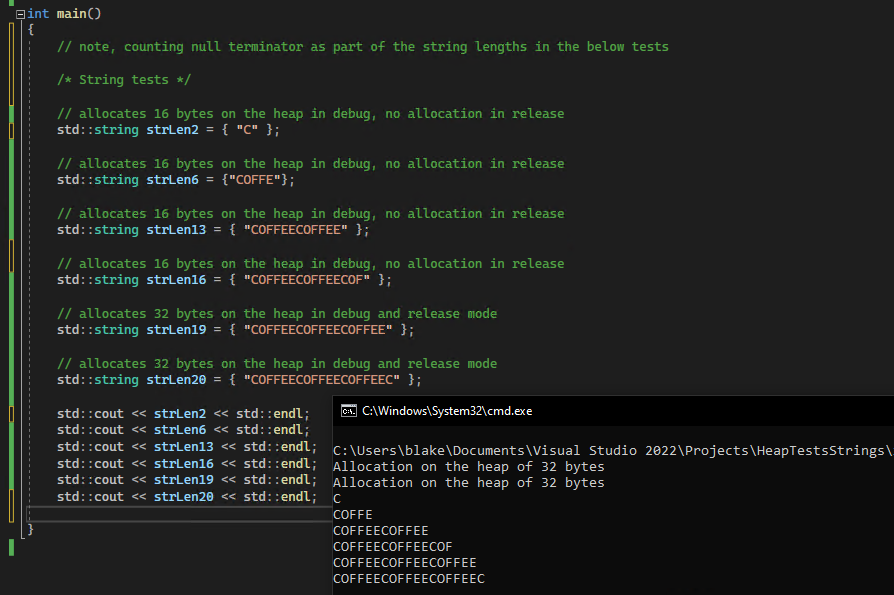
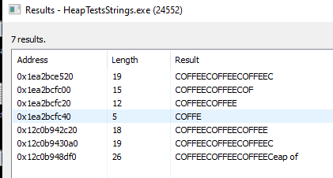
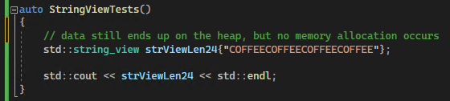

# Heap Data

## Why do we care about the heap 

- A heap is a region of reserved addressed space
* The number of heaps for a process can vary but there is at least one
- The heap manager is responsible for committing and freeing memory
- Commonly used by Windows functions to store temporary data
    Example: Converting ANSI to UNICODE string will result in Windows allocating memory on the heap to store the temporary data
- The default process heap is destroyed when the process ends
- From an opsec perspective, our data may end up on the heap which could be used for detection purposes or to identify sensitive items such as encryption keys.
    - This may persist throughout the processes lifecycle

## Strings and the Heap with C++

- In C++, strings may be stored on the stack or on the heap
    - std::string uses std::allocate by default. std::allocate ends up calling new and delete to dynamically allocate memory
    - For performance optimization, if a std::string has less characters than the defined maximum, the stack will be used instead of the heap. However, this is compiler and OS specific
- std::string_view does not perform a memory allocation
    - In testing with Visual Studio 2022 Enterprise, version 17.4.3 on Windows 10, data does still end up on the heap
- std::make_unique performs a memory allocation and data ends up on the heap

## std::string 

Once the string length is over 16 characters, an allocation on the heap occurs. Viewing the strings in memory, we can see the strings with a length of 18 and beyond (not counting the null terminator) are stored on the heap. This test was run with Visual Studio 2022 on Windows 10.

## string_view 

Using string_view, no memory allocation seems to have occurred, however data was still found on the heap. This test was run with Visual Studio 2022 on Windows 10.

