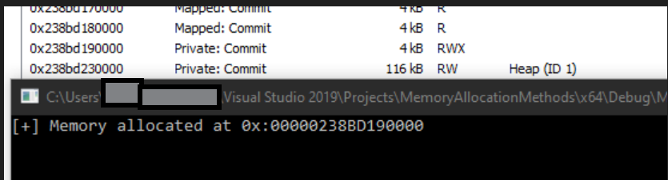
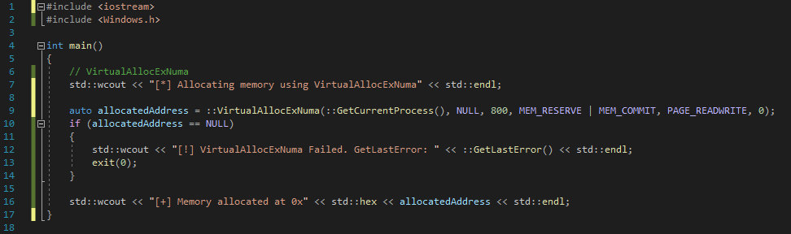
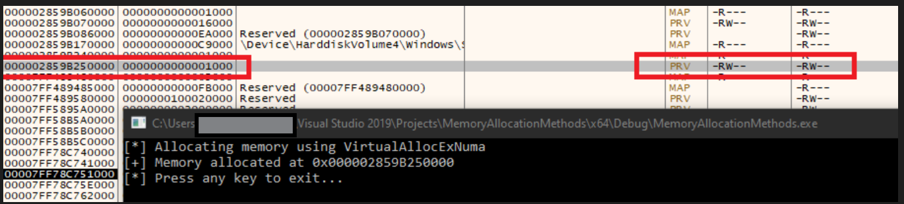
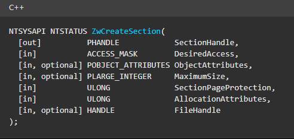
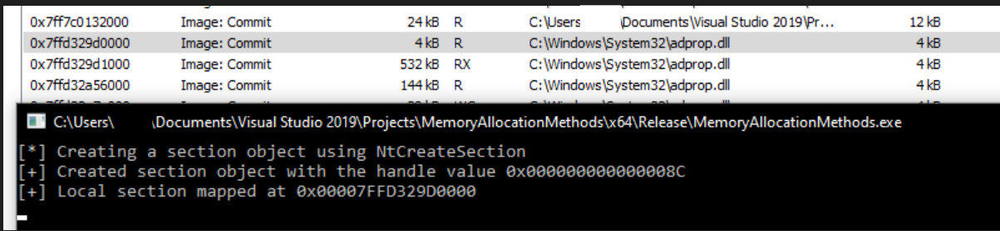

# Memory Allocation Methods

Methods to allocate memory in a process

## Overview 

Allocation Methods Overview
Allocation Methods by API
 - VirtualAlloc / NtVirtualAlloc
 - VirtualAllocExNuma
 - NtCreateSection
 - HeapCreate / HeapAlloc
Allocation methods mapping

## Allocation methods 

- Windows offers developers multiple APIs that can be used to allocate memory in a process
- Examples:
    - VirtualAllocEx / NtVirtualAllocEx
    - VirtualAlloc / NtVirtualAlloc
    - NtCreateSection
    - HeapCreate
    - VirtualAllocExNuma
- The API used will have an effect on the allocated memory characteristics, which needs to be considered from a memory evasion perspective

## Memory allocation functions

- A process can manipulate the virtual memory of itself, or with the correct permissions, the memory of another process
- Memory allocations can be performed using the following:
    - Virtual API: used for general memory management. Includes - VirtualAlloc, VirtualProtect, VirtualFree, etc. These end up calling NtAllocateVirtualMemory.
    - Heap API: generally used for small allocations that are less than a page in size. Internally uses the Virtual API with additional management features added. 
    Includes HeapAlloc, HeapCreate, HeapDestroy, HeapLock, etc
    - Memory-mapping: used to map files as memory or share memory between processes. Includes CreateFileMapping, OpenFileMapping, MapViewOfFile, etc
    - Compiler specific: language/compiler specific implementations such as malloc, realloc, free, new, delete, etc

References: Windows Internals 7th Edition, Part 1

## Memory allocation types

- Process memory falls under three categories:
    - Private Memory (MEM_PRIVATE) - generic memory allocated using NtAllocateVirtualMemory. Historically used by malware / offensive tools
    - Mapped Memory (MEM_MAPPED) - mapped files other than images. Files mapped in this manner may or may not be backed by a file on disk
    - Image Memory (MEM_IMAGE) - mapped views of sections created with the SEC_IMAGE flag from a file on disk (exe/DLL). Expected for PE files loaded by the OS

The pros and cons of each memory type are discussed in the memory evasion slides in detail, however the MEM_IMAGE is what is “expected” and often the preferred method from an opsec perspective

## VirtualAlloc / NtVirtualAlloc

- VirtualAlloc is used to reserve, commit, or change the state of memory
- The Ex version of the functions are available for allocation into a remote process
    - VirtualAllocEx / NtVirtualAllocEx
- Memory mapped by VirtualAlloc is private
- Ends up calling NtAllocateVirtualMemory
- Potential indicators:
    - Use of the APIs with a call to NtAllocateVirtualMemory
    - New memory mapped as private

## VirtualAlloc / NtVirtualAlloc

- Example of using VirtualAlloc to allocate memory
- Viewing the allocation shows the memory is marked as private

## VirtualAllocExNuma 

- Used by malware such as TrickBot, Emotet, and Bazar to allocate memory
- VirtualAllocExNuma ends up calling NtAllocateVirtualMemory
- Non Uniform Memory Access ( NUMA ) is a method to configure memory management in system with more than one CPU
- Potential indicators:
    - Memory is allocated as private
    - Transition to NtAllocateVirtualMemory

Benefit of the technique of using such an API is for products that monitor at the usermode level and may hook higher functions. If the hook or monitoring is done at the NtAllocateVirtualMemory API, then there is really no difference between this or the other various VirtualAlloc functions

### Example of allocating memory using VirtualAllocExNuma

- VirtualAllocExNuma calls NtAllocateVirtualMemory
- Memory is allocated as private memory

## NtCreateSection

- Creates a section object
- A section object is a section of memory that can be shared with other processes
- Common usage is to create a new section object, write to the created section (shellcode, etc.), then map the section into the target process
- If the SEC\_IMAGE flag is passed and an invalid PE file is used as a handle, the function will fail
- Potential Indicators:
    - Call to NtCreateSection
    - Memory is mapped as MEM_MAPPED

Example of creating a section object using NtCreateSection

## NtCreateSection - Module overloading

- NtCreateSection can be combined with NtMapViewOfFile/CreateFile to map memory as SEC_IMG with a file backed on disk
- SEC_IMAGE flag will cause memory to be allocated using the permissions from the file
- NtMapViewOfSection is then used to map the file into the process
- The memory permissions are modified (as required) and the contents of the file in memory overwritten
- Potential Indicators:
    - Use of NtMapViewOfFile, NtCreateSection, and CreateFile (or one of the variants)
    - Loading of a DLL into the process address space
    - Modification to memory permissions (potential)
    - Contents in memory do not match file on disk

Module overloading is covered in additional detail in the process injection section/slides

Mapping a module using NtCreateSection and NtMapViewOfSection

Resulting view of memory for module overloading

Note the memory permissions are mapped as expected for each section. The importance of this is discussed in detail in the memory evasion section.

## HeapCreate / HeapAlloc

- The heap is a private block of one or more pages in the process
- HeapCreate is used to create a private heap object
- HeapAlloc takes the handle created using HeapCreate and allocates the memory on the process heap
- HeapCreate calls RtlCreateHeap
- HeapAlloc calls RtlAllocHeap which uses NtAllocateVirtualMemory to reserve and commit memory for the heap
- Memory is mapped as private
- Potential indicators:
    - Use of the HeapCreate/RtlHeapCreate and HeapAlloc/RtlHeapAlloc
    - Creation of private memory
    - Call to NtAllocateVirtualMemory

- Allocating memory with HeapCreate and HeapAlloc
- Memory is mapped as private_ and RWX

## Memory allocation methods mapping

### Windows memory allocation → NT call map

| Method (user-mode)                                             | Under the hood (runtime path)                                                                                                        | Primary NT call(s)                                                                       | Notes                                                                                                                                               |
| -------------------------------------------------------------- | ------------------------------------------------------------------------------------------------------------------------------------ | ---------------------------------------------------------------------------------------- | --------------------------------------------------------------------------------------------------------------------------------------------------- |
| **operator new / delete** (MSVC)                               | `operator new` → UCRT `_malloc_base/_aligned_malloc_base` → `HeapAlloc(GetProcessHeap)` / `HeapFree` → `RtlAllocateHeap/RtlFreeHeap` | `NtAllocateVirtualMemory` / `NtFreeVirtualMemory` (when heap grows/shrinks)              | “Compiler specific”: MSVC uses UCRT + Process Heap; Clang/MinGW on Win also route to msvcrt/HeapAlloc → same NT calls.                              |
| **malloc / free / calloc / realloc**                           | C runtime → `HeapAlloc/HeapReAlloc/HeapFree` → `RtlAllocateHeap/RtlFreeHeap`                                                         | `NtAllocateVirtualMemory` / `NtFreeVirtualMemory`                                        | Heap growth commits via `Nt…`; day-to-day small blocks stay within heap arenas (LFH etc.).                                                          |
| **\_aligned\_malloc / \_aligned\_free**                        | C runtime aligned wrappers → `HeapAlloc` with alignment shim                                                                         | `NtAllocateVirtualMemory` / `NtFreeVirtualMemory`                                        | Alignment handled in user mode; NT layer unchanged.                                                                                                 |
| **new\[] / delete\[]**                                         | Same as `new/delete`                                                                                                                 | Same as above                                                                            | Array size bookkeeping in runtime only.                                                                                                             |
| **HeapCreate / HeapDestroy**                                   | `RtlCreateHeap / RtlDestroyHeap`                                                                                                     | `NtAllocateVirtualMemory` (reserve/commit region for heap), later `NtFreeVirtualMemory`  | Creates private heaps; allocations inside still use `RtlAllocateHeap`.                                                                              |
| **HeapAlloc / HeapReAlloc / HeapFree**                         | `RtlAllocateHeap / RtlReAllocateHeap / RtlFreeHeap`                                                                                  | `NtAllocateVirtualMemory` / `NtFreeVirtualMemory` (only when heap needs more/less pages) | Uses LFH/segment heap depending on OS + opts.                                                                                                       |
| **GlobalAlloc / LocalAlloc**                                   | Thunks to Process Heap (`HeapAlloc/Free`)                                                                                            | Same as Heap\*                                                                           | Legacy; maps to heap since Win32.                                                                                                                   |
| **CoTaskMemAlloc / CoTaskMemFree**                             | OLE allocator → Process Heap (`RtlAllocateHeap/RtlFreeHeap`)                                                                         | Same as Heap\*                                                                           | Used by COM/WinRT marshalling.                                                                                                                      |
| **IMalloc::Alloc/Free** (COM)                                  | Usually delegates to `CoTaskMem*`                                                                                                    | Same as Heap\*                                                                           | Implementation-specific but commonly process heap.                                                                                                  |
| **VirtualAlloc / VirtualAllocEx**                              | Kernel32 → `NtAllocateVirtualMemory`                                                                                                 | `NtAllocateVirtualMemory`                                                                | Direct VA reservation/commit.                                                                                                                       |
| **VirtualAlloc2 / VirtualAlloc2FromApp / VirtualAllocFromApp** | Kernel32 → `NtAllocateVirtualMemoryEx`                                                                                               | `NtAllocateVirtualMemoryEx`                                                              | Allows page-placement, NUMA, attributes; FromApp enforces AppContainer limits. *(Native API name often considered semi-undocumented for app devs.)* |
| **VirtualFree / VirtualFreeEx**                                | Kernel32 → `NtFreeVirtualMemory`                                                                                                     | `NtFreeVirtualMemory`                                                                    | Decommit/release pages.                                                                                                                             |
| **VirtualProtect / VirtualProtectEx**                          | Kernel32 → `NtProtectVirtualMemory`                                                                                                  | `NtProtectVirtualMemory`                                                                 | Change page protections.                                                                                                                            |
| **VirtualLock / VirtualUnlock**                                | Kernel32 → `NtLockVirtualMemory / NtUnlockVirtualMemory`                                                                             | `NtLockVirtualMemory` / `NtUnlockVirtualMemory`                                          | Page-pinning (working set) hints.                                                                                                                   |
| **CreateFileMapping**                                          | Kernel32 → `NtCreateSection`                                                                                                         | `NtCreateSection`                                                                        | Backed by file handle or pagefile (for shared mem).                                                                                                 |
| **MapViewOfFile / MapViewOfFileEx**                            | Kernel32 → `NtMapViewOfSection`                                                                                                      | `NtMapViewOfSection`                                                                     | Maps a `SECTION` into VA space.                                                                                                                     |
| **UnmapViewOfFile**                                            | Kernel32 → `NtUnmapViewOfSection`                                                                                                    | `NtUnmapViewOfSection`                                                                   | Unmaps view.                                                                                                                                        |
| **LoadLibrary / LdrLoadDll**                                   | `LdrLoadDll` → `NtCreateSection` + `NtMapViewOfSection` (+ reloc, import fixups)                                                     | `NtCreateSection`, `NtMapViewOfSection`                                                  | Image mapping is section-based, not `VirtualAlloc`.                                                                                                 |
| **RtlCreateHeap / RtlDestroyHeap**                             | NTDLL heap manager                                                                                                                   | `NtAllocateVirtualMemory` / `NtFreeVirtualMemory`                                        | Direct Native API (documented but “native”); used by Heap\*.                                                                                        |
| **RtlAllocateHeap / RtlFreeHeap**                              | NTDLL heap manager ops                                                                                                               | Uses `NtAllocateVirtualMemory` to grow/shrink regions                                    | Building block for all heap-based allocators.                                                                                                       |
| **AWE (AllocateUserPhysicalPages / MapUserPhysicalPages)**     | Kernel32 → `NtAllocateUserPhysicalPages` / `NtMapUserPhysicalPages`                                                                  | `NtAllocateUserPhysicalPages`, `NtMapUserPhysicalPages`                                  | Locked, non-pageable “AWE” memory; specialized.                                                                                                     |
| **CreateDIBSection** (GDI)                                     | GDI → section or heap depending on flags                                                                                             | `NtCreateSection` / `NtMapViewOfSection` (often)                                         | Backing store may be a section; varies by format/driver.                                                                                            |

**Undocumented/Native notes**

* `Nt*` functions are part of the Native API in **ntdll.dll**. They’re exported but largely undocumented for general Win32 app dev; official docs live in WDK/driver spheres.
* `Rtl*` heap routines are exported and documented but still “native layer”; apps usually call Heap\*/CRT instead.
* Segment Heap / LFH behavior is entirely inside `Rtl*`; the NT calls appear only when (de)committing pages.

Several VirtualAlloc* APIs exist and this list is not exhaustive, however they all transition to NtAllocateVirtualMemory

## Memory Allocation Exercise

- Create classes for the allocation methods discussed
    - NtVirtualAllocateMemory
    - NtVirtualAllocEx
    - NtCreateSection
    - HeapCreate / HeapAlloc
    - CoTaskMemAlloc

Exercise - NtAllocateVirtualMemory Example

