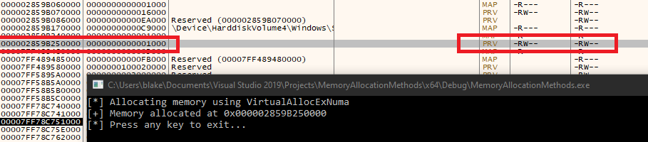
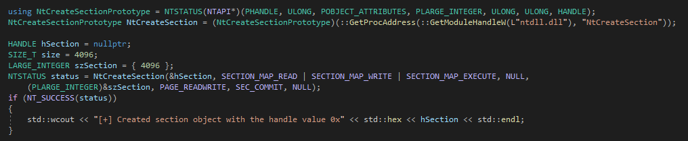
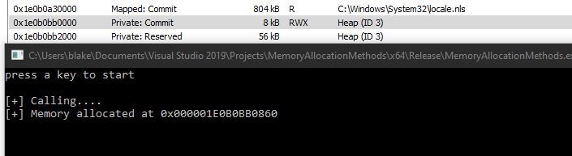

# Memory Allocation Methods

## Slide 1

Memory Allocation 

Methods to allocate memory in a process

## Slide 2

Agenda 

Allocation Methods Overview
Allocation Methods by API
VirtualAlloc / NtVirtualAlloc
VirtualAllocExNuma
NtCreateSection
HeapCreate / HeapAlloc
Allocation methods mapping

## Slide 3

Allocation methods 

Windows offers developers multiple APIs that can be used to allocate memory in a process
Examples:
VirtualAllocEx / NtVirtualAllocEx
VirtualAlloc / NtVirtualAlloc
NtCreateSection
HeapCreate
VirtualAllocExNuma
The API used will have an effect on the allocated memory characteristics, which needs to be considered from a memory evasion perspective

## Slide 4

Memory allocation functions

A process can manipulate the virtual memory of itself, or with the correct permissions, the memory of another process
Memory allocations can be performed using the following:
Virtual API: used for general memory management. Includes VirtualAlloc, VirtualProtect, VirtualFree, etc. These end up calling NtAllocateVirtualMemory.
Heap API: generally used for small allocations that are less than a page in size. Internally uses the Virtual API with additional management features added. Includes HeapAlloc, HeapCreate, HeapDestroy, HeapLock, etc
Memory-mapping: used to map files as memory or share memory between processes. Includes CreateFileMapping, OpenFileMapping, MapViewOfFile, etc
Compiler specific: language/compiler specific implementations such as malloc, realloc, free, new, delete, etc

**Speaker Notes:** References: Windows Internals 7th Edition, Part 1

## Slide 5

Memory allocation types

 Process memory falls under three categories:
Private Memory (MEM\_PRIVATE) - generic memory allocated using NtAllocateVirtualMemory. Historically used by malware / offensive tools
Mapped Memory (MEM\_MAPPED) - mapped files other than images. Files mapped in this manner may or may not be backed by a file on disk
Image Memory (MEM\_IMAGE) - mapped views of sections created with the SEC\_IMAGE flag from a file on disk (exe/DLL). Expected for PE files loaded by the OS

**Speaker Notes:** The pros and cons of each memory type are discussed in the memory evasion slides in detail, however the MEM_IMAGE is what is “expected” and often the preferred method from an opsec perspective

## Slide 6

VirtualAlloc / NtVirtualAlloc

VirtualAlloc is used to reserve, commit, or change the state of memory
The Ex version of the functions are available for allocation into a remote process
VirtualAllocEx / NtVirtualAllocEx
Memory mapped by VirtualAlloc is private
Ends up calling NtAllocateVirtualMemory
Potential indicators:
Use of the APIs with a call to NtAllocateVirtualMemory
New memory mapped as private

## Slide 7

VirtualAlloc / NtVirtualAlloc

Example of using VirtualAlloc to allocate memory
Viewing the allocation shows the memory is marked as private

## Slide 8

VirtualAllocExNuma 

Used by malware such as TrickBot, Emotet, and Bazar to allocate memory
VirtualAllocExNuma ends up calling NtAllocateVirtualMemory
Non Uniform Memory Access ( NUMA ) is a method to configure memory management in system with more than one CPU
Potential indicators:
Memory is allocated as private
Transition to NtAllocateVirtualMemory

**Speaker Notes:** Benefit of the technique of using such an API is for products that monitor at the usermode level and may hook higher functions. If the hook or monitoring is done at the NtAllocateVirtualMemory API, then there is really no difference between this or the other various VirtualAlloc functions

## Slide 9

VirtualAllocExNuma 

Example of allocating memory using VirtualAllocExNuma

## Slide 10

VirtualAllocExNuma 

VirtualAllocExNuma calls NtAllocateVirtualMemory
Memory is allocated as private memory

## Slide 11

NtCreateSection

Creates a section object
A section object is a section of memory that can be shared with other processes
Common usage is to create a new section object, write to the created section (shellcode, etc.), then map the section into the target process
If the SEC\_IMAGE flag is passed and an invalid PE file is used as a handle, the function will fail
Potential Indicators:
Call to NtCreateSection
Memory is mapped as MEM\_MAPPED

## Slide 12

NtCreateSection

Example of creating a section object using NtCreateSection

## Slide 13

NtCreateSection - Module overloading

NtCreateSection can be combined with NtMapViewOfFile/CreateFile to map memory as SEC\_IMG with a file backed on disk
SEC\_IMAGE flag will cause memory to be allocated using the permissions from the file
NtMapViewOfSection is then used to map the file into the process
The memory permissions are modified (as required) and the contents of the file in memory overwritten
Potential Indicators:
Use of NtMapViewOfFile, NtCreateSection, and CreateFile (or one of the variants)
Loading of a DLL into the process address space
Modification to memory permissions (potential)
Contents in memory do not match file on disk

**Speaker Notes:** Module overloading is covered in additional detail in the process injection section/slides

## Slide 14

NtCreateSection

Mapping a module using NtCreateSection and NtMapViewOfSection

## Slide 15

NtCreateSection

Resulting view of memory for module overloading

**Speaker Notes:** Note the memory permissions are mapped as expected for each section. The importance of this is discussed in detail in the memory evasion section.

## Slide 16

HeapCreate / HeapAlloc

The heap is a private block of one or more pages in the process
HeapCreate is used to create a private heap object
HeapAlloc takes the handle created using HeapCreate and allocates the memory on the process heap
HeapCreate calls RtlCreateHeap
HeapAlloc calls RtlAllocHeap which uses NtAllocateVirtualMemory to reserve and commit memory for the heap
Memory is mapped as private
Potential indicators:
Use of the HeapCreate/RtlHeapCreate and HeapAlloc/RtlHeapAlloc
Creation of private memory
Call to NtAllocateVirtualMemory

## Slide 17

HeapCreate / HeapAlloc

Allocating memory with HeapCreate and HeapAlloc
Memory is mapped as private and RWX

## Slide 18

Memory allocation methods mapping

**Speaker Notes:** TO DO: Need to detail the underlying functions for the compiler specific

## Slide 19

Memory allocation methods mapping

**Speaker Notes:** Several VirtualAlloc* APIs exist and this list is not exhaustive, however they all transition to NtAllocateVirtualMemory

## Slide 20

Memory Allocation Exercise

Create classes for the allocation methods discussed
NtVirtualAllocateMemory
NtVirtualAllocEx
NtCreateSection
HeapCreate / HeapAlloc
CoTaskMemAlloc

## Slide 21

Exercise - NtAllocateVirtualMemory Example

