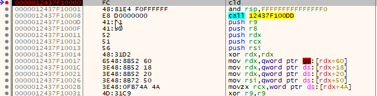
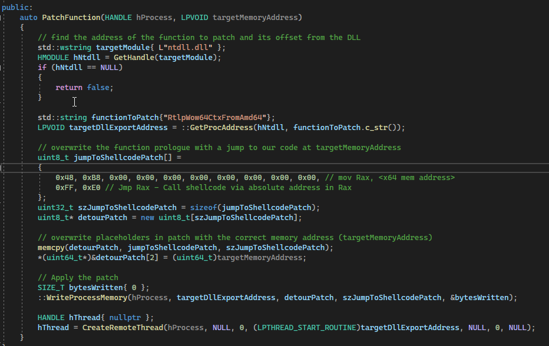
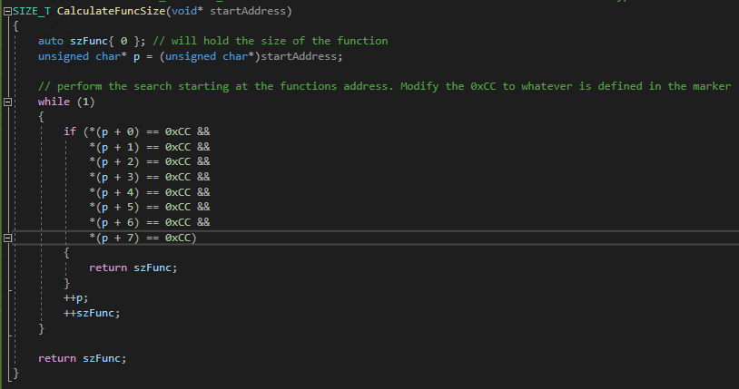

# Memory Obfuscation and Evasion
## Overview

Memory allocations
Memory permissions
Controlling the originating thread
Patching
SetThreadContext
beginthreadex

## Memory allocation review

- A process can manipulate the virtual memory of itself, or with the correct permissions, the memory of another process
- Memory allocations can be performed using the following:
    - Virtual API: used for general memory management. Includes VirtualAlloc, VirtualProtect, VirtualFree, etc. These end up calling NtAllocateVirtualMemory.
    - Heap API: generally used for small allocations that are less than a page in size. Internally uses the Virtual API with additional management features added. Includes HeapAlloc, HeapCreate, HeapDestroy, HeapLock, etc
    - Memory-mapping: used to map files as memory or share memory between processes. Includes CreateFileMapping, OpenFileMapping, MapViewOfFile, etc
    - Compiler specific: language/compiler specific implementations such as malloc, realloc, free, new, delete, etc

References: Windows Internals 7th Edition, Part 1

## Memory allocation review

- Process memory falls under three categories:
- Private Memory (MEM_PRIVATE) - generic memory allocated using NtAllocateVirtualMemory (historically used by malware / offensive tools)
- Mapped Memory (MEM_MAPPED) - mapped files other than images. Files mapped in this manner may or may not be backed by a file on disk
- Image Memory (MEM_IMAGE) - mapped views of sections created with the SEC_IMAGE flag from a file on disk (exe/DLL). Expected for PE files loaded by the OS


## Memory permissions

- PAGE_EXECUTE_READWRITE (RWX) marks the memory as writable, readable and executable
    - This allows for code to be written, modify itself, and execute. RWX allocations are viewed as suspicious and best avoided
- As a workaround to RWX, memory may be marked as PAGE_READWRITE (RW), the code written to the memory space, then modified with NtProtectVirtualMemory to PAGE_EXECUTE_READ (RX) to allow for execution
    - This avoids RWX sections and the Virtual Address Descriptor table checked by some memory forensics tools will show RW even after modifying to RX
- Scanning of memory can be an expensive process, so the characteristics (e.g. MEM_IMAGE vs MEM_PRIVATE) and permissions are often used to determine what memory is scanned

## Memory opsec considerations

- Opsec considerations:
    - Avoid RWX allocations whenever possible. If required, look for processes with RWX memory sections already present (example: SMSvcHost.exe)
    - Attempt to mimic the expected permissions for each section if applicable (e.g. text section should be RX, data section RW, etc.)
    - MEM_IMAGE allocations backed by a file on disk are generally seen as less suspicious
    - Memory containing artifacts, such as shellcode, encryption keys, domain names, etc. should be cleared when no longer required
    - Break up shellcode or other large allocations as the size of the allocation maybe a consideration for identifying suspicious memory regions. The default page size on x64 is 4kB, so allocating in chunks of 4kB may be a viable option for blending in

## Enumerating process memory for permissions

Example if enumerating memory permissions for running processes to identify private memory with RWX permissions

CreateToolhelp32Snapshot is used to grab a snapshot of the currently running processes. The code then attempts to call OpenProcess to get a handle for each process. VirtualQueryEx is used to query the process and then a check is done for RWX memory that was allocated as private. Note, the call to OpenProcess may fail if the code is not ran in an elevated context or the process is protected.


## Specifying the originating thread location

- The traditional usage of CreateRemoteThread to execute shellcode in another process will cause a thread to be executed that is not originating from an expected module/function not backed by a file on disk
- This indicator may be used by security products to identify suspicious code executing in memory
- Sample methods to avoid the indicator:
    -Modify the prologue of a function expected to create a thread to jump to the shellcode
    - Spawn a suspended thread with the start address at a chosen function, modify the instruction pointer of the thread to point to the shellcode, then resumes the thread
    - Replacing CreateRemoteThread with QueueUserAPC
    - Using _threadstartex for creating a thread locally
-This will result in the thread originating from an expected function/module

## Specifying the originating thread location

The screenshot below shows a new thread being created using CreateRemoteThread to execute shellcode at the memory address 0x12437f100. Note the thread originates from memory that points to the shellcode




## Specifying the thread location using patching

Example code to patch a function with a jump to attacker allocated memory. This will cause the thread to originate from a function within a module such as ntdll

The code finds the address to the function to patch, which in this case is RtlpWow64CtxFromAmd64 in ntdll. The patch is then adjusted to account for the location of the shellcode/code which is passed into the function as a parameter (targetMemoryAddress). The target function prologue is then overwritten with the patch, which will cause a jump to the shellcode/code when called. Finally, CreateRemoteThread is used to start execution at the patched function, which cause the thread executing the shellcode/code to originate from the specified function/module.


References:
https://blog.redbluepurple.io/offensive-research/bypassing-injection-detection
https://github.com/forrest-orr/artifacts-kit/blob/master/ArtifactsKit/Console.cpp



## Specifying the thread location using patching

The target function has been patched with a jump to the memory address containing our code

A breakpoint is placed on the target function in the process we are injecting into, which is notepad in this example. After writing the patch, we can see the change to the function prologue. RAX now holds our shellcode, which is just INT3 (\xCC) and NOP instructions (\x90) in this example.


## Specifying the thread location using patching

The result is the start address of the thread which executes the shellcode now originates from the target function, which is RtlpWow64CtxFromAmd64 in this case, instead of the memory location of the shellcode


## Specifying thread location with SetThreadContext

- The address of the target function is found
- A new thread pointing to the address of the target function is then created in a suspended state
- GetThreadContext is used to find the current value of the instruction pointer for the suspended thread
- The instruction pointer is then updated to point to the memory address of the code to be executed
- SetThreadContext is then used to update the values and the thread is resumed using ResumeThread
- This results in the thread being created from a function of our choosing backed on disk that then executes the code at the target memory address

Reference:
https://blog.xpnsec.com/undersanding-and-evading-get-injectedthread/

## Specifying thread location with SetThreadContext

Spawning a thread from a function and modifying with SetThreadContext

The address of the target function is found, which is RtlpWow64CtxFromAmd64 in NTDLL in this example. A new thread pointing to the address of the target function is then created in a suspended state. GetThreadContext is used to find the current value of the instruction pointer for the suspended thread. The instruction pointer is then updated to point to the memory address of the code to be executed. SetThreadContext is then used to update the values and the thread is resumed using ResumeThread. This results in the thread being created from a function of our choosing backed on disk that then executes the code at the target memory address.


## Specifying thread location with SetThreadContext

The thread that executes the shellcode is started from the RtlpWow64CtxFromAmd64 function within NTDLL


## Specifying thread location with _beginthreadex

_beginthreadex accepts multiple parameters including the start address of a routine to execute as a new thread, and the arguments to pass to the new thread
The function then calls _threadstartex in msvcrt.dll in order to create the new thread
The thread’s entry point will originate from msvcrt.dll, bypassing checks to ensure the thread is backed by a file on disk
This technique will not work for remote process injections

Reference: https://www.trustedsec.com/blog/avoiding-get-injectedthread-for-internal-thread-creation/


## Leveraging QueueUserAPC


- QueueUserAPC allows an attacker to schedule code execution in the context of an existing thread by queuing an Asynchronous Procedure Call (APC). 
- This technique is often used for process injection, as it enables shellcode or malicious routines to be executed without creating a new thread, helping to evade detection mechanisms that monitor thread creation. The APC is delivered when the target thread enters an alertable state (e.g., via SleepEx or WaitForSingleObjectEx).

- **Opsec benefit:** The thread’s start address remains legitimate, and the injected code is executed as an APC, making it harder for security products to detect suspicious activity.
- **Limitation:** The target thread must enter an alertable state for the APC to be executed.


Reference:
https://rastamouse.me/exploring-process-injection-opsec-part-2/

## Thread Stack Spoofing


Thread stack spoofing involves manipulating the thread’s call stack to make it appear as though the thread originated from a legitimate module or function. Attackers may modify the stack frames or use techniques to fake the call stack, making analysis tools and memory scanners believe the thread is benign.

- **Purpose:** Evade detection by security products that analyze thread call stacks for suspicious origins or execution flow.
- **Implementation:** This can involve overwriting return addresses, adjusting stack pointers, or using custom shellcode loaders that mimic legitimate stack frames.


Reference:
https://github.com/hasherezade/pe-sieve/wiki/4.9.-Scan-threads-callstack-(threads)


## Image and process notifications

- MS provides the ability to register callbacks that will be executed upon the creation of a process and/or thread
- Examples include PsSetCreateProcessNotifyRoutineEx, PsSetCreateThreadNotifyRoutineEx, and PsSetLoadImageNotifyRoutine
- Once the callback is triggered, actions such as scanning memory may be performed
- Note, the callbacks are not actually invoked until the first thread in the process is created


## Bypassing load notifications

Security products and EDRs often use image and process notification callbacks (such as PsSetLoadImageNotifyRoutine) to monitor when new modules are loaded into a process. These callbacks allow defenders to scan memory, inspect loaded images, or trigger additional monitoring when suspicious activity is detected. Attackers may attempt to bypass these notifications to avoid detection during module injection or code execution.

Common bypass techniques include:
- **Unregistering or removing callbacks:** With sufficient privileges (often via a vulnerable driver), malware can remove or disable security product callbacks, preventing notification of new image loads.
- **Direct system call usage:** Some malware avoids high-level APIs that trigger notifications and instead uses direct system calls or manual mapping to load modules, bypassing standard monitoring mechanisms.
- **Manual mapping:** Instead of using standard APIs like LoadLibrary, attackers manually map PE files into memory, which can evade callbacks that rely on standard loading routines.
- **Timing attacks:** Delaying or staggering module loads to avoid detection during periods of high monitoring activity.

By bypassing or disabling these notifications, attackers can inject code or load malicious modules with a reduced risk of being detected by security products that rely on these callbacks for visibility.

## Mirroring a PE header


Mirroring a PE header is a technique used to evade memory scanners and forensic tools that look for the presence of a valid Portable Executable (PE) header in memory. Instead of erasing or overwriting the PE header, malware may copy the original header to another location in memory before modifying or removing it from its original spot. This allows the malware to restore the header later if needed (for example, to resolve imports or for proper execution flow), while still evading detection by tools that scan for the "MZ" and "PE" signatures at expected locations.

- **Purpose:** This approach helps bypass security products that rely on the presence of a valid PE header to identify suspicious or injected modules in memory.
- **Implementation:** The malware first reads and saves the PE header to a safe location, then clears or modifies the original header. If the header is needed again, it can be restored from the mirrored copy.
- **Usage:** Mirroring is often used by advanced malware and offensive frameworks to maintain stealth while retaining the ability to interact with the PE structure as needed.


## Add malware that erases pe header

```
// ...existing code...
// Example C++ code to erase the PE header of the current process

#include <windows.h>

void ErasePEHeader()
{
    // Get the base address of the current module (the executable)
    HMODULE hModule = GetModuleHandle(NULL);
    if (!hModule) return;

    // Get the DOS header
    PIMAGE_DOS_HEADER pDosHeader = (PIMAGE_DOS_HEADER)hModule;
    // Get the NT header
    PIMAGE_NT_HEADERS pNtHeader = (PIMAGE_NT_HEADERS)((BYTE*)hModule + pDosHeader->e_lfanew);

    // Calculate the size of the PE header
    DWORD dwHeaderSize = pNtHeader->OptionalHeader.SizeOfHeaders;

    // Change memory protection to allow writing
    DWORD oldProtect;
    if (VirtualProtect((LPVOID)hModule, dwHeaderSize, PAGE_READWRITE, &oldProtect))
    {
        // Overwrite the header with zeros
        SecureZeroMemory((LPVOID)hModule, dwHeaderSize);

        // Restore original protection
        VirtualProtect((LPVOID)hModule, dwHeaderSize, oldProtect, &oldProtect);
    }
}

```

## Overwriting the PE header

Overwriting/erasing the PE header may be done to obfuscate a PE in memory
Bypasses memory scanners that look for the magic value “MZ”
Also serves as an anti-analysis technique as the dumped memory image would be missing items such as the addresses of various tables and the entry point
Used in frameworks such as Cobalt Strike and ….


Clearing the DOS header from memory. The same process of adjusting memory permissions/overwriting needs to occur for the NT Header


The top image shows the PE header before the overwrite and the image below shows the result after execution


## Obfuscating functions 

- Functions can be obfuscated in memory when not required to assist in evading memory scanning
- Process flow:
    - Get the address in memory of the function to obfuscate
    - Calculate the size of the function
    - If necessary, change the memory permissions to allow writes
    - Obfuscate the function
    - Revert changes to memory permissions (optional)
- Calculating the size of the function can be done by searching for a marker at the end of the function
- Examples of malware/frameworks using function/data obfuscation include Cobalt Strike and Smoke Loader

References:
https://gurhanpolat.medium.com/calculate-c-function-size-x64-x86-c1f49921aa1a
https://cert.pl/en/posts/2018/07/dissecting-smoke-loader/#function-body-encryption

## Obfuscating functions 
- The following example shows the creation of a macro for a inserting the marker that is used to determine the size of the function
- __debugbreak() is equivalent to \xCC (INT3/breakpoint instruction). This can be modified as required for another pattern

References:
https://gurhanpolat.medium.com/calculate-c-function-size-x64-x86-c1f49921aa1a


## Obfuscating functions 

A search is then performed for the marker and the size returned

References:
https://gurhanpolat.medium.com/calculate-c-function-size-x64-x86-c1f49921aa1a



## Obfuscating functions 

Within the function to encrypt, a volatile variable is defined in order to prevent the compiler from optimizing out the marker

References:
https://gurhanpolat.medium.com/calculate-c-function-size-x64-x86-c1f49921aa1a


## Obfuscating functions 

- The address of the function can be determine in C++ in the following manner, where FuncToEncrypt is the target function:

```
void* funcToEncryptAddress = FuncToEncrypt;
```
- Once the address and size of the function is known, VirtualProtect or similar can be used to change the permissions of memory and then reverted once obfuscation is completed
- Obfuscation/encryption can then be performed. The screenshot below shows a simple XOR on the function


## Gargoyle

Gargoyle is a memory evasion framework designed to help attackers and red teamers bypass memory scanners and EDR solutions. It achieves this by leveraging techniques such as in-memory function obfuscation, dynamic code encryption, and execution flow manipulation. Gargoyle can encrypt payloads in memory and only decrypt them when needed for execution, minimizing the time malicious code is exposed in a detectable state. This approach helps evade both static and dynamic memory analysis, making detection by security products significantly more difficult. Gargoyle demonstrates how advanced memory evasion techniques can be combined to create highly stealthy malware or offensive tooling.

References:  
https://github.com/Jenkin-Gao/Gargoyle  
https://www.mdsec.co.uk/2020/01/edr-evasion-ten-process-injection-techniques/

## Stage vs Stageless Shellcode

## Stage vs Stageless Shellcode

When considering memory obfuscation and evasion, the choice between staged and stageless shellcode has significant operational and detection implications.

**Staged shellcode** is designed to minimize the initial memory footprint by loading only a small "stager" into memory, which then retrieves or loads the main payload (the "stage") from another source, such as a remote server or a secondary file. This approach can help evade static and memory-based detection, as the main malicious code is not present in memory until needed and may only exist briefly. Attackers may further obfuscate the stager or encrypt the stage in transit and in memory, only decrypting it at execution time to reduce exposure to memory scanners. Staged payloads are also useful for bypassing network or host-based controls that monitor for large or suspicious memory allocations.

**Stageless shellcode**, on the other hand, contains the entire payload in a single contiguous block of code that is loaded directly into memory. While this increases the initial memory footprint and may be more easily detected by memory scanners, stageless payloads can be obfuscated or encrypted in memory to evade detection. Techniques such as dynamic decryption, function-level obfuscation, and memory permission manipulation (e.g., marking memory as RW until execution is required, then switching to RX) are often used to hide stageless shellcode from analysis tools. Stageless payloads are favored in environments where reliability is critical and network access is restricted, but require additional memory evasion techniques to remain stealthy.

Both approaches can leverage advanced memory evasion tactics, such as breaking up allocations, mimicking legitimate memory regions, or using custom loaders that erase or mirror PE headers. The choice between staged and stageless shellcode is often dictated by the threat actor’s need to balance stealth, reliability, and operational complexity in the face of modern memory scanning