# Process Injection

## Slide 1

Process Injection

Subtitle

## Slide 2

Agenda

What is process injection
Allocation methods
Write methods
Process injection techniques
Detecting process injection
Lab

## Slide 3

What is process injection

Process injection is a method of executing arbitrary code in the address space of a separate live process. Running code in the context of another process may allow access to the process’s memory, system/network resources, and possibly elevated privileges. Execution via process injection may also evade detection from security product since the execution is masked under a legitimate process.

## Slide 4

Allocation Methods 

Various APIs can be used to allocate memory for the code to be injected
Example Windows APIs:
VirtualAllocEx / NtVirtualAllocEx
VirtualAlloc / NtVirtualAlloc
NtCreateSection
HeapCreate
VirtualAllocExNuma
The technique used will have an effect on the allocated memory characteristics (e.g. private memory vs mapped memory), which needs to be considered from a memory evasion perspective (more on this later)

## Slide 5

Write Methods 

Write methods are the APIs used to copy the attacker’s code into the target’s memory
Example Windows APIs:
WriteProcessMemory / NtWriteVirtualMemory
NtMapViewOfSection
RtlMoveMemory / RtlCopyMemory / MoveMemory / CopyMemory
Memcpy / memmove

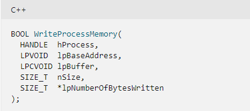

## Slide 6

CreateRemoteThread

From MSDN: “Creates a thread that runs in the virtual address space of another process”
Overview:
Open a handle to the target process (OpenProcess)
Allocate memory for the shellcode / path to the DLL (VirtualAllocEx)
Write the shellcode / path (WriteProcessMemory)
For DLL Injection, get the address of LoadLibrary (GetProcAddress)
Call CreateRemoteThread (or NtCreateThreadEx) with the address of the shellcode or LoadLibrary + path to the DLL to be injected
Used by APT37 to inject shellcode into notepad to load RokRat

**Speaker Notes:** Reference: https://blog.malwarebytes.com/threat-analysis/2021/01/retrohunting-apt37-north-korean-apt-used-vba-self-decode-technique-to-inject-rokrat/

## Slide 7

CreateRemoteThread

Injecting shellcode into notepad

**Speaker Notes:** The code shown in the screenshot was used to inject x64 shellcode created with msfvenom into notepad. Note the new thread ID associated with RtlUserThreadStart that was created as part of the injection process.

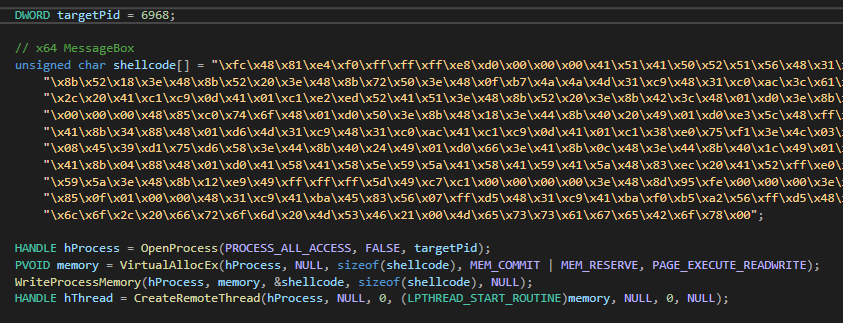

## Slide 8

Callbacks

A callback is defined by Mozilla as a function that is passed into another function as an argument, which is then invoked
Multiple Windows APIs require an argument that is a pointer to the callback function to be called
To execute shellcode, the memory address where the shellcode has been injected is passed as the argument for the callback function
Example APIs: CallWindowProc, EnumResourceTypes, EnumWindowStations, EnumDesktops, EnumWindows, EnumFonts, LineDDA, GrayString, CreateThreadpoolWait
Used by Nobelium to execute shellcode using CreateThreadpoolWait
Used by Lazarus to execute shellcode as part of a VBA macro (UuidFromStringA API)

**Speaker Notes:** References:
https://www.microsoft.com/security/blog/2021/05/28/breaking-down-nobeliums-latest-early-stage-toolset/

## Slide 9

Callbacks

Example of executing shellcode using EnumUILanguagesA

**Speaker Notes:** 

## Slide 10

Process Hollowing

Technique to replace the code in memory of a legitimate process with the attacker’s code
Overview:
Spawn a new process in a suspended state (CreateProcess)
Get the base address of target process (ReadProcessMemory / NtReadVirtualMemory)
Unmap/hollow the original executable code (NtUnmapViewOfSection)
Allocate Memory (VirtualAllocEx)
Write PE to be injected (WriteProcessMemory/NtWriteVirtualMemory)
Set the thread context of the primary thread (SetThreadContext/NtSetThreadContext)
Resume the process (ResumeThread/NtResumeThread)

**Speaker Notes:** References:

## Slide 11

Process Hollowing

Examples of malware/frameworks that leverages process hollowing:
SmokeLoader
Bazar
Cobalt Strike

**Speaker Notes:** References:
https://n1ght-w0lf.github.io/malware%20analysis/smokeloader/#process-hollowing
https://www.cybereason.com/blog/a-bazar-of-tricks-following-team9s-development-cycles

## Slide 12

Process Hollowing

Partial code example for process hollowing

**Speaker Notes:** References:

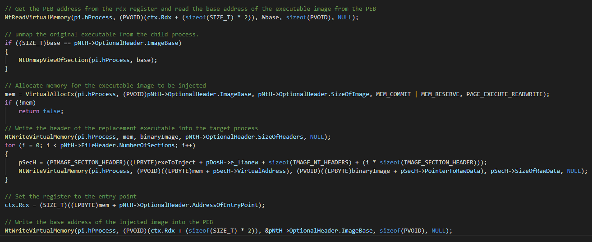

## Slide 13

Thread Hijacking

Technique to hijack the execution flow of a thread in a process which is redirected to the attacker’s code
May be used to blend in as execution will occur from a legitimate process
Overview:
Open a handle to the target process (OpenProcess)
Allocate memory in the target process (VirtualAllocEx)
Write shellcode into memory (WriteProcessMemory)
Find the thread ID to hijack (CreateToolhelp32Snapshot & Thread32Next)
Open a handle to the target thread (OpenThread)
Suspend the thread (SuspendThread)
Update the thread’s instruction pointer to point at the shellcode (Context)
Set the threads context (SetThreadContext)
Resume the thread (ResumeThread)

**Speaker Notes:** 

## Slide 14

Thread Hijacking

Malware thread hijacking example….

**Speaker Notes:** 

## Slide 15

Thread Hijacking

Example thread hijacking code

**Speaker Notes:** CreateProcess is used to spawn a new process that will be injected into the main thread, so in this case we do not need to use CreateToolhelp32Snapshot & Thread32Next to find the thread ID. The THREAD_QUERY_INFORMATION flag in the call to OpenThread is also optional and not necessary in this code example.

## Slide 16

QueueUserAPC / NtQueueUserAPC

Asynchronous Procedure Call (APC)
Per MSDN: An APC is a function that executes asynchronously in the context of a particular thread
When an APC is queued, the system issues a software interrupt and the next time the thread is scheduled, it will run the APC function
When a user-mode APC is queued, the thread is not directed to call the function unless its in an alertable state
A thread enters an alertable state when calling SleepEx, SignalObjectAndWait, WaitForMultipleObjectsEx, WaitForSingleObjectEx, MsgWaitForMultipleObjectsEx or NtTestAlert
The QueueUserAPC function is used to queue an APC including specifying the address of the function to run

**Speaker Notes:** 

## Slide 17

QueueUserAPC / NtQueueUserAPC

Strategies to satisfy the requirement for an alertable state:
Create an event for each thread in the target process, and then ask each thread to set its corresponding event. We’ll then wait on the event handles until one is triggered. The thread whose corresponding event is triggered is an alertable thread - Tal Liberman in Atom Bombing
Alertable threads can be detected by simply reading the context of a remote thread and examining the control and integer registers - Itzik Kolter and Amit Klein in Process Injection Techniques – Gotta Catch Them All
Create a new process in a suspended state, queue the APC and resume the thread(s) - Early Bird technique
Queue an APC on all threads in the process (likely unintended side effects / crashes)
If you’re running managed .NET executables compiled by the .NET Framework or .NET Core, the default executing thread will always become alertable due to the way AppDomain unloading is handled on process exit - Dwight Hohnstein

**Speaker Notes:** References: 
https://www.fortinet.com/blog/threat-research/atombombing-brand-new-code-injection-technique-for-windows
https://www.blackhat.com/us-19/briefings/schedule/#process-injection-techniques---gotta-catch-them-all-16010
https://modexp.wordpress.com/2019/08/27/process-injection-apc/
https://www.ired.team/offensive-security/code-injection-process-injection/early-bird-apc-queue-code-injection
https://posts.specterops.io/the-curious-case-of-queueuserapc-3f62e966d2cb

## Slide 18

QueueUserAPC / NtQueueUserAPC

Overview of injection process (once an alertable thread is found)
Get a handle to the target process (OpenProcess)
Allocate memory (VirtualAllocEx)
Write shellcode to memory (WriteProcessMemory)
Queue the thread(s) (QueueUserAPC or NtQueueUserAPC)
Used by Ursniff by executing a PowerShell script to get the current process, write a DLL into memory, call QueueUserAPC to queue the current thread, and then call SleepEx which triggers the thread to enter an alertable state
APT33 used the “Early Bird” QueueUserAPC technique in their TurnedUp malware to evade hooks placed by security products

**Speaker Notes:** References: https://www.cyberbit.com/blog/endpoint-security/new-early-bird-code-injection-technique-discovered/

## Slide 19

QueueUserAPC / NtQueueUserAPC

QueueUserAPC example that suspends the main thread, queues the APC with the function pointing to shellcode, and then resumes the thread

**Speaker Notes:** 

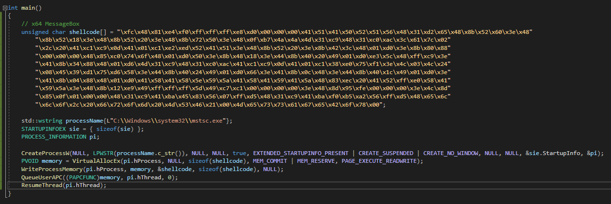

## Slide 20

DLL Injection

DLL injection is used to load a DLL into the process address space of another process
Overview:
Locate the target’s process ID to inject the DLL into (CreateToolhelp32Snapshot/Process32First/Process32Next)
Allocate space to store the path to the DLL to be injected (VirtualAllocEx)
Write the path to the DLL into memory of the target process (WriteProcessMemory)
Execute the DLL by passing the address of LoadLibrary to an API such as CreateRemoteThread/RtlCreateUserThread/NtCreateThreadEx
Disadvantages:
Injected DLL will show up as a loaded module in the process
DLL resides on the file system

**Speaker Notes:** malware families using it

## Slide 21

DLL Injection

Injecting a DLL on disk into a remote process

## Slide 22

Reflective DLL injection

Technique to load a DLL into memory using a custom loader
Improves upon DLL injection as it does not require the DLL to reside on the filesystem and the DLL does not show up as a loaded module
DLLs to be injected are built with a reflective loader function which is responsible for mapping the DLL into memory
Overview:
Obtain a handle to the target process (OpenProcess)
Allocate memory for the DLL to be injected (VirtualAllocEx)
Calculate the memory offset for performing the reflective loading
Start execution in the target process using the offset address of the reflective loader function as the entry point (CreateRemoteThread/RtlCreateUserThread)
The reflective loader find the PEB which is used to locate the address of kernel32.dll
Kernel32 is parsed to find the necessary API functions
Parsed functions are used to load the DLL into memory and call DllMain

**Speaker Notes:** References:
https://github.com/stephenfewer/ReflectiveDLLInjection
https://disman.tl/2015/01/30/an-improved-reflective-dll-injection-technique.html

## Slide 23

Reflective DLL injection

Variations and improvements have occurred since Stephen Fewer’s initial publication of the code to include:
Dan Staples “Improved Reflective DLL Injection”
Ability to call an additional function after DLLMain
Support for passing arguments to function
zerosum0x0 “ThreadContinue - Reflective DLL Injection Using SetThreadContext() and NtContinue()”
Reflective DLL has been used in frameworks/malware such as Metasploit, Cobalt Strike, …. 

**Speaker Notes:** References:
https://disman.tl/2015/01/30/an-improved-reflective-dll-injection-technique.html
https://zerosum0x0.blogspot.com/2017/07/threadcontinue-reflective-injection.html?m=1

## Slide 24

Reflective DLL injection

Create a reflective DLL using Stephen Fewer’s ReflectiveDLLInjection project:
Clone the project from the github: https://github.com/stephenfewer/ReflectiveDLLInjection
Create a new DLL project in Visual Studio
Remove pch.h and pch.cpp from the project
Right click on Source Files and select the options to add an existing item. Select ReflectiveLoader.c from the cloned github
Repeat for the Header Files and add ReflectiveDLLInjection.h and ReflectiveLoader.h
Right click on the project, select properties, go to C/C++, select Precompiled Header and set the “Set Precompiled Headers” option to “Not Using Precompiled Headers”
Select C/C++, Preprocessor, Preprocessor Definitions and under the Set Processor Definitions, and the following (for Release, x64 as target): WIN64;WIN\_X64;REFLECTIVE\_DLL\_EXPORTS;REFLECTIVEDLLINJECTION\_VIA\_LOADREMOTELIBRARYR;REFLECTIVEDLLINJECTION\_CUSTOM\_DLLMAIN
For x86, follow the process above but set the Preprocessor Definition to WIN32; WIN\_X86

**Speaker Notes:** References:
https://ijustwannared.team/2018/02/13/reflective-dlls-and-you/

## Slide 25

Reflective DLL injection

The github project includes binaries to test injecting the DLL
Note, the DLL does not show up in the injected process as a loaded module

**Speaker Notes:** References:

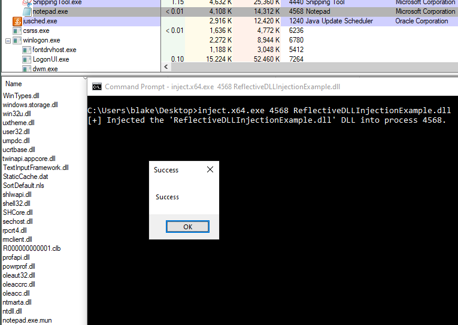

## Slide 26

Reflective DLL injection

Viewing process memory shows a section of private memory, not backed by a file on disk, with RWX permissions, and a PE header (the injected DLL)

**Speaker Notes:** References:

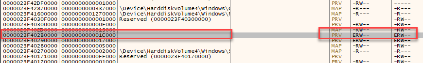

## Slide 27

Reflective DLL injection

By default, the DLL will also contain the export “ReflectiveLoader”

**Speaker Notes:** References:

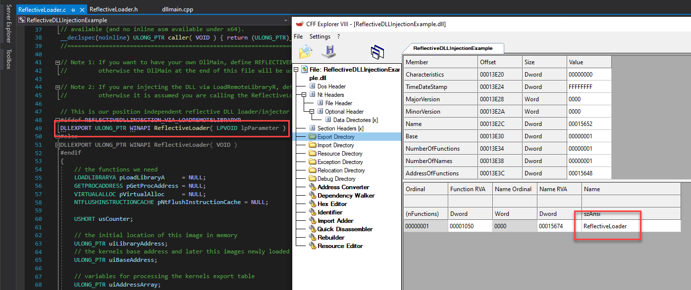

## Slide 28

sRDI

Shellcode Reflective DLL Injection (sRDI) by Nick Landers (monoxgas)
Reflective DLL Injection requires the target DLL to be written to support the technique, often requiring source code and/or a modification to existing code
sRDI addresses the limitation by allowing for any DLL to be converted to position independent shellcode that can be injected into a process
Overview of the process:
Bootstrap code get the current location in memory
Bootstrap code sets up registers
Bootstrap passes execution to the reflective DLL
The reflective DLL unpacks the DLL and maps sections in memory
DLLMain is called
Optionally, exported functions are called and user arguments passed 

**Speaker Notes:** References:
https://www.netspi.com/blog/technical/adversary-simulation/srdi-shellcode-reflective-dll-injection/
https://github.com/monoxgas/sRDI

## Slide 29

sRDI

The DLL is converted to shellcode using the ConvertTo-Shellcode PowerShell script in the sRDI project and then injected into the current process

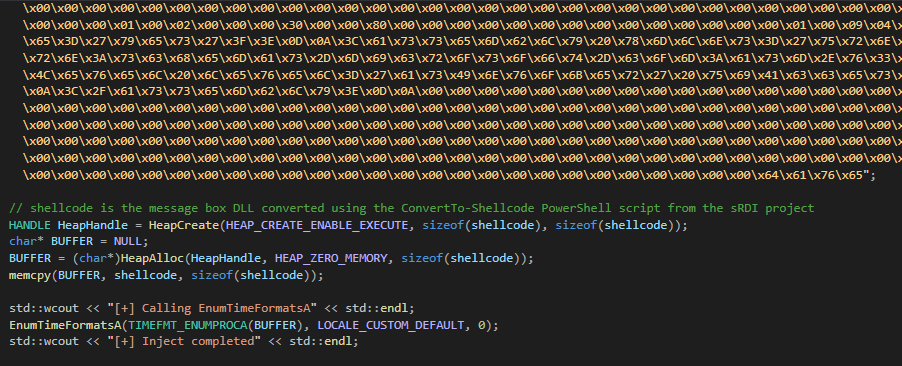

## Slide 30

Module stomping

Overview:
Load a legitimate DLL (module) into a process that the process does not require (usually done with a call to LoadLibrary)
Find the AddressofEntryPoint for the DLL and overwrite it with shellcode
Start a new thread at the DLL’s entry point to execute the shellcode
Benefits to this technique include:
Avoids allocation of Read Write Execute (RWX) memory pages or changing the associated permissions (e.g. RW then using VirtualProtect to change to RX)
The shellcode runs from memory backed by a file on disk (and signed depending on the DLL chosen)

**Speaker Notes:** References:
https://blog.f-secure.com/hiding-malicious-code-with-module-stomping/
https://www.ired.team/offensive-security/code-injection-process-injection/modulestomping-dll-hollowing-shellcode-injection

## Slide 31

Module stomping

To avoid potential issues, the DLL must be large enough to hold the shellcode and the DLL must not be used by either the shellcode or the process
Detecting module stomping:
Compare contents of memory to disk (slow process)
Acquire the original module from the vendor from the debug symbol server and use a utility such as ChkImg to verify the DLL (symbols must be available for the module)
Identify executable sections in the Virtual Address Descriptor (VAD) in the process then gather the details of those sections from the Page Frame Number (PFN) database in order to identify anomalies such as the process of a modified flag and a share count of zero (Kernel driver needed and prone to false positives)
Walk the loaded module list in the process’ PEB and for each module, check if EntryPoint value is NULL and LDRP\_IMAGE\_DLL or ImageDll is set to false (detection for Cobalt Strike method of module stomping which is due to the use of LoadLibraryEx with the DONT\_RESOLVE\_DLL\_REFERENCES flag)

**Speaker Notes:** References:
https://blog.f-secure.com/cowspot-real-time-module-stomping-detection/
https://github.com/slaeryan/DetectCobaltStomp

## Slide 32

Module stomping

Malware using module stomping ….

**Speaker Notes:** Add

## Slide 33

AddressOfEntryPoint 

Overview:
Create a process in a suspended state (CreateProcess)
Find the AddressOfEntryPoint of the suspended process (NtQueryInformationProcess / ReadProcessMemory)
Write the shellcode at the AddressOfEntryPoint location (WriteProcessMemory)
Resume the process (ResumeThread)
Avoids allocation of Read Write Execute (RWX) memory pages in the target process

**Speaker Notes:** Reference: https://www.ired.team/offensive-security/code-injection-process-injection/addressofentrypoint-code-injection-without-virtualallocex-rwx

## Slide 34

AddressOfEntryPoint 

Example code for injection on x64 systems

**Speaker Notes:** Code based off https://www.ired.team/offensive-security/code-injection-process-injection/addressofentrypoint-code-injection-without-virtualallocex-rwx with modifications to work on x64

## Slide 35

NtCreateSection / NtMapViewOfSection 

Overview:
Create a new memory section with RWX permissions (NtCreateSection)
Map a view of the created section to the current process with RW permissions (NtMapViewOfSection)
Map a view of the created section in the target process with RX permissions (NtMapViewOfSection)
Copy the shellcode into the section of the current process, which will update the target process’ mapped section with the shellcode as well (memcpy)
Execute the shellcode in the target process (RtlCreateUserThread)
Avoids allocation of Read Write Execute (RWX) memory pages in the target process
Technique used by LockPoS

**Speaker Notes:** NtCreateSection can be used to create a memory block that is shared between processes. A section with READ_WRITE permissions is created in the current process (the malware) and a section is created in the target process with READ_EXECUTE permissions. When the shellcode is copied by the malware to the mapped section locally, the section in the target process will also be updated. This has the benefit of avoiding allocation of memory pages in the target process with RWX permissions.

References:
https://i.blackhat.com/USA-19/Thursday/us-19-Kotler-Process-Injection-Techniques-Gotta-Catch-Them-All-wp.pdf
https://www.ired.team/offensive-security/code-injection-process-injection/ntcreatesection-+-ntmapviewofsection-code-injection
https://www.cyberbit.com/blog/endpoint-security/new-lockpos-malware-injection-technique/

## Slide 36

NtCreateSection / NtMapViewOfSection

Memory is mapped as READ\_EXECUTE in the remote process

## Slide 37

Loading C# into Unmanaged Process

Steps
Load CLR with CLRCreateInstance and GetRuntime APIs to load the target .NET framework version
Use GetDefaultDomain and memcpy to copy assembly bytes into the default App Domain
Format arg string to pass to assembly so it can be parsed by Main assembly function
Create and read mail slots with CreateMailslot and GetMailslotInfo to get redirected stdout/stderr
Used by frameworks/tools such as:
Cobalt Strike

**Speaker Notes:** Reference: https://www.ired.team/offensive-security/code-injection-process-injection/addressofentrypoint-code-injection-without-virtualallocex-rwx

## Slide 38

Loading C# into Unmanaged Process

Loading the CLR

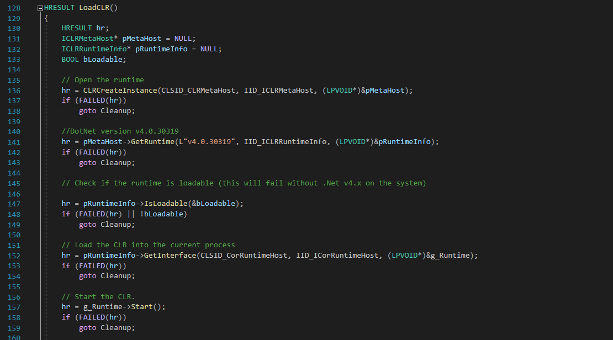

## Slide 39

Loading C# into Unmanaged Process

Getting default App Domain and loading assembly bytes

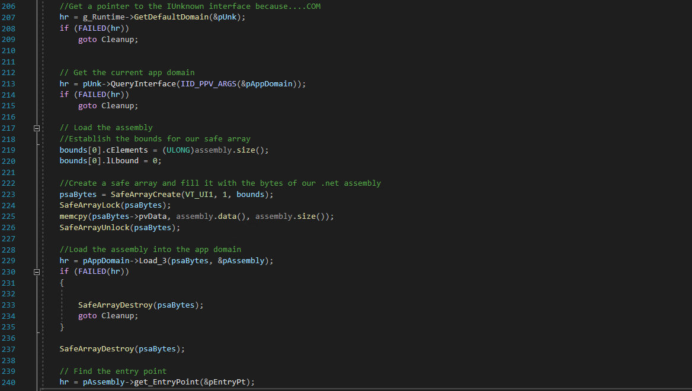

## Slide 40

Loading C# into Unmanaged Process

Passing reformatted arg string to the injected assembly

## Slide 41

Loading C# into Unmanaged Process

Stdout/Stderr can be redirected/read via Mail Slots or Named Pipes

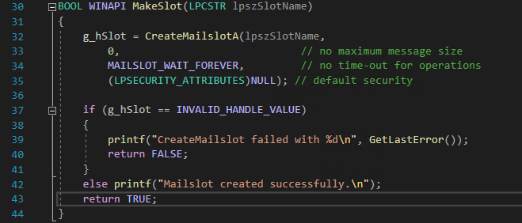

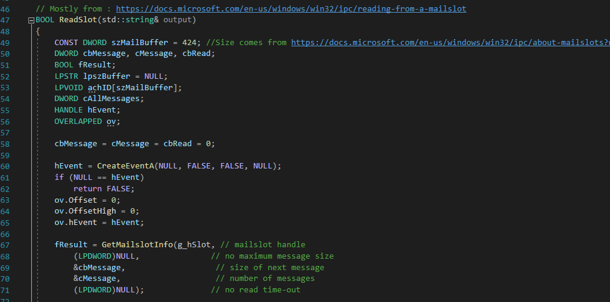

## Slide 42

Loading C# into Unmanaged Process

Normal assembly execution vs loading CLR assembly in unmanaged process

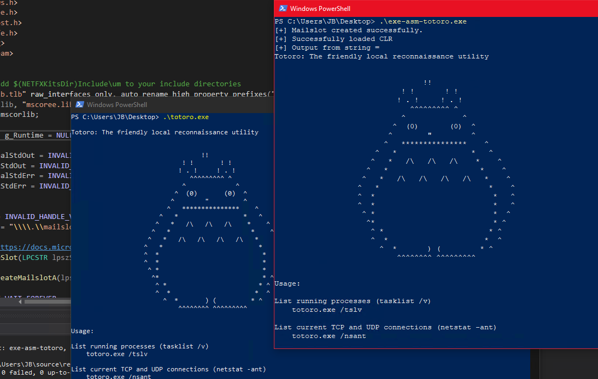

## Slide 43

Loading C# into Unmanaged Process

Alternative: CLRVoyance can create shellcode to load CLR and assembly, can be used with your shellcode loaders to inject into a local or remote process

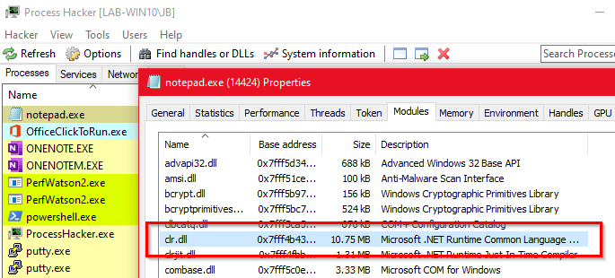

## Slide 44

AppDomainManager Injection (.NET)

“An application domain forms an isolated boundary within the application for security, versioning, reliability and unloading of managed code” - MSDN
At runtime, all managed code is loaded into the application domain
The AppDomainManager class enables a process to create a new application domain
“An AppDomainManager object participates in the creation of new application domains in a process and can customize the new AppDomain before other managed code runs” - MSDN

**Speaker Notes:** Not an exhaustive list, but other examples of code injection techniques.

## Slide 45

AppDomainManager Injection (.NET)

Methods to replace the default AppDomainManager:
Set the environment variables APPDOMAIN\_MANAGER\_ASM and APPDOMAIN\_MANAGER\_TYPE
Add/modify the  and  elements in the configuration file

**Speaker Notes:** Not an exhaustive list, but other examples of code injection techniques.

## Slide 46

AppDomainManager Injection (.NET)

Process injection overview:
Copy the .NET binary to a location under the attacker’s control (not necessary if you have writable access to the directory)
Create a configuration file (.e.g. binaryname.exe.config) with the values adjusted appropriately (see screenshot below). The appDomainManagerType value should match what we set in the code

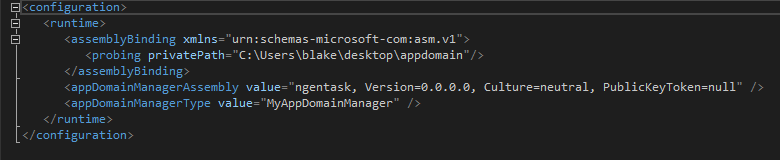

## Slide 47

AppDomainManager Injection (.NET)

Process injection overview:
Create a new AppDomainManager (see screenshot below)
Compile to a DLL: csc.exe /target:library /out:ngentask.dll program.cs
Place the DLL in the same directory as the target binary (ngentask in this example) and the configuration file

## Slide 48

Additional methods 

Various other methods for process injection exists including:
Atom Bombing
Ghost Writing
SetWindowLong / SetWindowLongPtr
PROPagate
Kernel Callback Table
Ctrl-Injection
Service Control

USERDATA
ALPC Callback
WNF callback
Stack Bombing
Shatter style injections
Process Doppelganging
API Hooking

**Speaker Notes:** Not an exhaustive list, but other examples of code injection techniques.

## Slide 49

Lab

Placeholder

## Slide 50

Appendix

## Slide 51

Cobalt Strike’s shspawn and shinject Commands

shspawn
Inject local shellcode file into the defined sacrificial process
Syntax: shspawn [ x86 | x64 ] [ /path/to/shellcode.bin ]

**Speaker Notes:** Reference: https://www.ired.team/offensive-security/code-injection-process-injection/addressofentrypoint-code-injection-without-virtualallocex-rwx

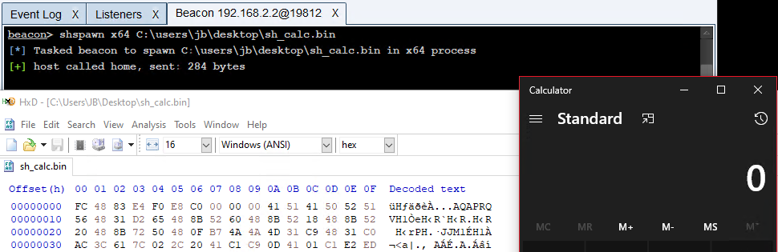

## Slide 52

Cobalt Strike’s shspawn and shinject Commands

shinject
Inject local shellcode file into an arbitrary process
Syntax: shinject [ PID ] [ x86 | x64 ] [ /path/to/shellcode.bin ]

**Speaker Notes:** Reference: https://www.ired.team/offensive-security/code-injection-process-injection/addressofentrypoint-code-injection-without-virtualallocex-rwx

## Slide 53

Cobalt Strike’s shspawn and shinject Commands

Converting an existing DLL into position-independent shellcode using ConvertToShellcode.py
https://github.com/monoxgas/sRDI

**Speaker Notes:** Reference: https://www.ired.team/offensive-security/code-injection-process-injection/addressofentrypoint-code-injection-without-virtualallocex-rwx

## Slide 54

Cobalt Strike’s BOF (Beacon Object Files)

Advantages
Extensible framework to execute native code within the CS Beacon process
Does not spawn the sacrificial process, does not use named pipes
Steps
Include beacon.h and define a go() function
Adjust usage of Win32 APIs and define preprocessor macros to fix printf() or other functions
Compile but do not link
Syntax: inline-execute [ /path/to/bof.o ]
References
https://www.cobaltstrike.com/blog/credbandit-a-review-of-a-tool-developed-built-by-the-cobalt-strike-user-community/
https://hstechdocs.helpsystems.com/manuals/cobaltstrike/current/userguide/content/topics/beacon-object-files\_main.htm
https://github.com/ajpc500/BOFs

**Speaker Notes:** Reference: https://www.ired.team/offensive-security/code-injection-process-injection/addressofentrypoint-code-injection-without-virtualallocex-rwx

## Slide 55

Cobalt Strike’s BOF (Beacon Object Files)

hello world:

fixing printf():

Win32 APIs:

**Speaker Notes:** Reference: https://www.ired.team/offensive-security/code-injection-process-injection/addressofentrypoint-code-injection-without-virtualallocex-rwx

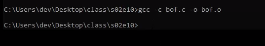

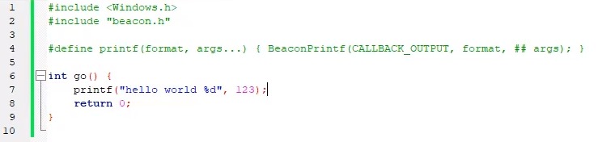

## Slide 56

Detecting process injection 

Placeholder

