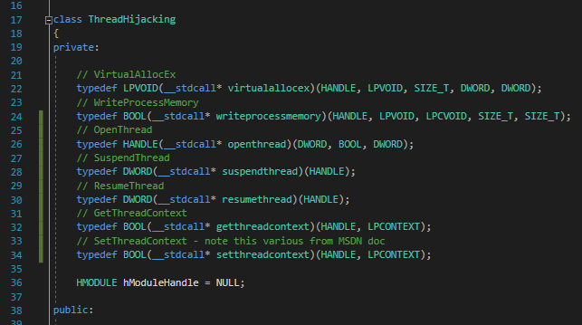

# Runtime Linking

## Slide 1

Runtime Linking

## Slide 2

Static vs Runtime vs Dynamic

Static linking - all code from a library is copied into the resulting program
Increased file size that may not be suitable for items such as PE Hollowing
Dynamic linking - searches for and loads libraries required when program loads
Follows the standard windows search order process
Runtime linking - Load functions from libraries only when the function is needed
LoadLibrary/LoadLibraryEx or similar to load the library required. Alternatively, GetModuleHandle can be used if the library is already loaded into memory
GetProcAddress/LdrGetProcAddress or similar to get the address of the function
Runtime linking can be useful to reduce overall size and obfuscate functions from automated analysis (e.g. VirtualAllocEx -> WriteProcessMemory -> CreateRemoteThread)

## Slide 3

Runtime Linking Steps

Define the prototype for the function you want to use
Example for WriteProcessMemory:
typedef BOOL(\_\_stdcall\* writeprocessmemory)(HANDLE, LPVOID, LPCVOID, SIZE\_T, SIZE\_T);

## Slide 4

Runtime Linking Steps (continued)

Get a handle to the library that contains the function you want to load
Example:
std::wcout << "[+] Loading DLL for runtime linking" << std::endl;
HANDLE hModuleHandle = ::LoadLibrary(LPWSTR(L“kernel32.dll”));
if (hModuleHandle == NULL)
{
std::wcout << “[!] LoadLibrary failed” << std::endl;
return hModuleHandle;
}
return hModuleHandle;

## Slide 5

Runtime Linking Steps (continued)

Get the address of the function using GetProcAddress or similar
Example:
writeprocessmemory rtlWriteProcessMemory;
rtlWriteProcessMemory = reinterpret\_cast(::GetProcAddress(hModuleHandle, LPCSTR("WriteProcessMemory")));
Call the function:
if (!(\*rtlWriteProcessMemory)(hProcess, memory, &scode, sizeof(scode), NULL))
{
…..
}

## Slide 6

Results

Analysis before applying runtime linking to the code for thread hijacking

## Slide 7

Results

Analysis after applying runtime linking to the code for thread hijacking

## Slide 8

Example Code

