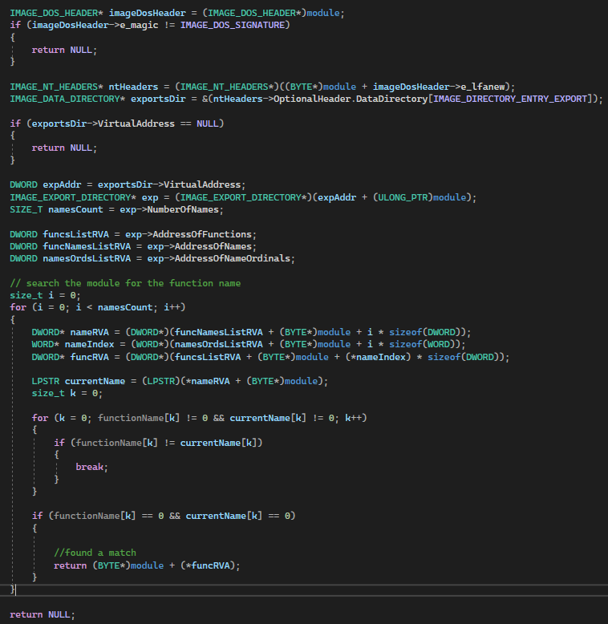
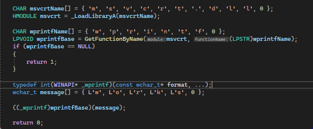
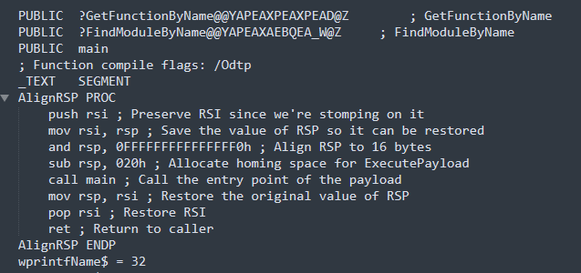
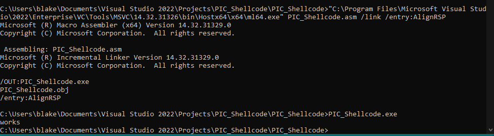
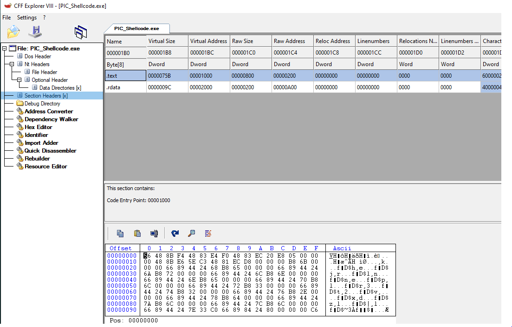

# Shellcode

## Slide 1

Shellcode

## Slide 2

Agenda

What is shellcode
Writing position independent code with VS

## Slide 3

What is shellcode

Shellcode is position independent code
Position independent code is code that can be executed in memory at any address without requiring modification, such as the need to align the stack
When delivering shellcode, an exploit developer can not guarantee where the code will reside in memory
For malware authors, shellcode may be used for initial staging or in-memory execution

## Slide 4

Position independent code

General guidance for achieving position independent code (PIC):
Cannot use addresses or reference data from other execution sections
Addresses references must be relative to the current instruction pointer
Code must be written so no relocations are required
Avoid the use of static libraries
Avoid the use of global and static variables

## Slide 5

Writing PIC 

Objective
Write x64 PIC code that can be extracted from the .text section of an executable
Approach
Resolve all imports during runtime
Avoid the use of strings or other data that would be stored outside the text section
Align the stack to account for x64
Replace mainCRTStartup with a custom entry point
Extract opcodes from the resulting text section and executed in memory

## Slide 6

Finding modules

For a PE loaded by the OS, the import address table will handle the resolving of all the APIs required
In this case, there is no import address table so the APIs will need to be manually resolved
The process environment block (PEB) contains a list of DLLs loaded in the process address space in the InMemoryOrderModuleList structure
Search the structure until the base address for kernel32 or ntdll is found

## Slide 7

PEB

The PEB is created at process runtime: \_\_readgsqword(0x60)
The Ldr (PEB\_LDR\_DATA structure) contains a doubly-linked list of the loaded modules (InMemoryOrderModuleList)
InMemoryOrderModuleList is a LIST\_ENTRY structure composed of the Flink and Blink

**Speaker Notes:** The TEB points to the PEB at offset 0x60 in x64 or offset 0x30 in x86
In x64, the GS register can be used to get the peb, and similarly the FS register may be used for x86

## Slide 8

Locating modules

Example of finding kernel32
Kernel32 can then be used to locate other functions that are required

**Speaker Notes:** References:
https://vxug.fakedoma.in/papers/VXUG/Exclusive/FromaCprojectthroughassemblytoshellcodeHasherezade.pdf
https://github.com/paranoidninja/PIC-Get-Privileges/blob/main/addresshunter.h
https://www.ired.team/offensive-security/code-injection-process-injection/writing-and-compiling-shellcode-in-c

## Slide 9

Finding function addresses

Walk the exports table of kernel32 or ntdll in order to find LoadLibrary/LdrLoadDll and GetProcAddress/LdrGetProcedureAddress
Note, this can be replace with custom versions instead if monitoring/hooking is a concern
The export table is contained in the Data Directory of the target module
Loop through the export table searching functions by name, get the relative virtual address (RVA), and add that to the module base to find the address of the target function
LoadLibrary and GetProcAddress can then be used to load the required DLLs and retrieve function addresses

## Slide 10

Finding functions

**Speaker Notes:** Reference: https://vxug.fakedoma.in/papers/VXUG/Exclusive/FromaCprojectthroughassemblytoshellcodeHasherezade.pdf

## Slide 11

Example code

The code follows the process outlined above and then resolves the required functions to print to the console

## Slide 12

Example code (continued)

## Slide 13

Compiling to assembly

Start the dev console for visual studio (2022 enterprise): cmd /k "C:\Program Files\Microsoft Visual Studio\2022\Enterprise\Common7\Tools\VsDevCmd.bat"
Compile by changing into the directory with cpp file then do the following: “C:\Program Files\Microsoft Visual Studio\2022\Enterprise\VC\Tools\MSVC\14.34.31933\bin\Hostx64\x64\cl.exe” /c /FA /GS- file.cpp

**Speaker Notes:** /c = compiles without linking
/FA = Configures an assembly listing file
/GS- = Disable check of buffer security

## Slide 14

Assembly modifications

Open the resulting assembly file and remove the following lines:
INCLUDELIB LIBCMT
INCLUDELIB OLDNAMES
Remove all pdata and xdata blocks

## Slide 15

Assembly modifications

Under the \_TEXT SEGMENT label, add the following assembly which will align the stack on x64 systems
AlignRSP PROC
push rsi ; Preserve RSI since we're stomping on it
mov rsi, rsp ; Save the value of RSP so it can be restored
and rsp, 0FFFFFFFFFFFFFFF0h ; Align RSP to 16 bytes
sub rsp, 020h ; Allocate space
call main ; Call the entry point
mov rsp, rsi ; Restore the original value of RSP
pop rsi ; Restore RSI
ret ; Return to caller
AlignRSP ENDP

**Speaker Notes:** Reference: 
https://github.com/mattifestation/PIC_Bindshell/blob/master/PIC_Bindshell/AdjustStack.asm

## Slide 16

Assembly modifications

Adding the assembly to align the stack

**Speaker Notes:** Reference: 
https://github.com/mattifestation/PIC_Bindshell/blob/master/PIC_Bindshell/AdjustStack.asm

## Slide 17

Assembly modifications

Modify the line mov rax, QWORD PTR gs:96 to mov rax, QWORD PTR gs:[96]

**Speaker Notes:** 

## Slide 18

Linking

Compile into an executable with the entrypoint modified
"C:\Program Files\Microsoft Visual Studio\2022\Enterprise\VC\Tools\MSVC\14.32.31326\bin\Hostx64\x64\ml64.exe" file.asm /link /entry:AlignRSP

**Speaker Notes:** 

## Slide 19

Extracting opcodes

Open the executable in COFF Explorer or similar
Right click on the opcodes in the bottom window and select all
Copy into a new file

**Speaker Notes:** 

## Slide 20

Extracting opcodes

**Speaker Notes:** 

## Slide 21

Formatting opcode

Format the resulting opcodes as required for the injection method
Example powershell to format to \x41\x42…
$var = 564600 # extracted opcodes
$temp = ([regex]::matches($var, '.{1,2}') | %{$\_.value}) -join '\x'
Write-Output "\x$temp"

**Speaker Notes:** 

## Slide 22

Execution

The resulting PIC can then be injected into memory

**Speaker Notes:** 

## Slide 23

Lab

Placeholder

