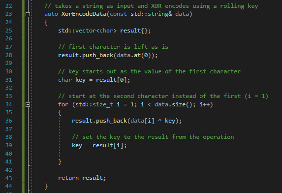

# String Obfuscation 

## Slide 1

Data Obfuscation

Common techniques used to obfuscate data

## Slide 2

Agenda

Why Obfuscation
Analyst Tools
Stack Strings
XOR
Rolling XOR
Character Substitution
Character Replacement
Decoy Strings
Other Obfuscation Methods

## Slide 3

Why Obfuscation

Help evade signature based detections
Potential to slow down analysis
Only expose data when needed
Make recovery of data more difficult

**Speaker Notes:** Screenshot shows a yara rule for Turla’s Outtook based backdoor which looks for specific plaintext strings
Reference: https://www.welivesecurity.com/wp-content/uploads/2018/08/Eset-Turla-Outlook-Backdoor.pdf

## Slide 4

Analyst tools

Various tools such as PeStudio and Sysinternals’ strings can be used to scan a file for strings
Fireeye Labs Obfuscated String Solver (FLOSS) was created to find and decode obfuscated strings using emulation
Fireeye’s Capa contains functionality to identify potential obfuscated files or information

**Speaker Notes:** FLOSS Reference: https://www.fireeye.com/blog/threat-research/2016/06/automatically-extracting-obfuscated-strings.html
Capa Reference: https://github.com/fireeye/capa
PeStudio Reference: https://www.winitor.com/ 
Sysinternals Strings Reference: https://docs.microsoft.com/en-us/sysinternals/downloads/strings

## Slide 5

Stack Strings

Malware commonly pushes the characters needed on to the stack in order to form the string required
This is done to avoid the discovery of the strings when analyzing the binary statically using malware analysis tools
The string is then created during execution
Example code in C++:
std::vector loadLibraryVector({ 'L', 'o', 'a', 'd', 'L', 'i', 'b', 'r', 'a', 'r', 'y' });
std::string loadLibrary(loadLibraryVector.begin(), loadLibraryVector.end());

## Slide 6

Stack Strings

The strings are pushed onto the stack individually

## Slide 7

Stack Strings

Note the LoadLibrary string is not present in the list of strings

## Slide 8

Stack Strings - PowerShell Script

Example powershell script to create a stack string
param ([Parameter(Mandatory)]$string)
[string]$stackString = ""
$charArray = ([char[]]$string)
$stackString = $charArray | ForEach-Object {"L`"" + $\_ + "`","}
$stackString = $stackString.Substring(0,$stackString.Length-1)
write-host $stackString

## Slide 9

Stack Strings - Preventing Automated Extraction

Malware analysis tools exists to identify the pattern commonly associated with stack strings (e.g. mov [ebp + var\_4], 'k')
To break this pattern, perform instructions that do not change the final value
For example: char k = {‘k’ \* 1}

## Slide 10

Stack Strings - Preventing Automated Extraction

The stack string created without the anti-pattern behavior is discovered by Floss, however the two use cases using the x \* 1 pattern remain undetected

## Slide 11

Adjusting the PowerShell Script

Example PowerShell script modified to prevent automatic extraction
param ([Parameter(Mandatory)][string]$string)
[string]$stackString = ""
$charArray = ([char[]]$string)
$stackString = $charArray | ForEach-Object {"L`'" + $\_ + "`' \* 1,"}
$stackString = $stackString.Substring(0,$stackString.Length-1)
write-host $stackString

## Slide 12

XOR

XOR => Exclusive OR
Takes a static value and modifies the plaintext by performing an XOR logical operation
Reversible to recover the plaintext value by simply repeating the operation
Example: result = plaintext ^ key;

## Slide 13

XOR

Using the same key for every byte is known as single-byte XOR
Drawbacks of single-byte XOR:
Quick to bruteforce (only 256 possible values for each character)
XOR operations performed on a null will result in the key value as the output
0x00 ^ 0x44 = 0x44
Malware often incorporates XOR encoding as step in a larger transformation process
Variants on XOR are commonly seen as well (e.g. Null preserving XOR)

## Slide 14

Rolling XOR

The first byte becomes the key and is used to xor the second byte
The result of the operation becomes the key to xor the third byte
Continue using the result of the previous xor as the key until we reach the end
Leveraged by UNC2452 within TEARDROP malware
Example:
Original data: 0x41, 0x42, 0x43, 0x44
0x41 XOR 0x42 = 0x03
0x03 XOR 0x43 = 0x40
0x40 XOR 0x44 = 0x04
Resulting encoded data: 0x41, 0x03, 0x40, 0x04

**Speaker Notes:** Teardrop malware reference: https://www.fireeye.com/blog/threat-research/2020/12/evasive-attacker-leverages-solarwinds-supply-chain-compromises-with-sunburst-backdoor.html
UNC2452 was the group believed to be behind the SolarWinds breach

## Slide 15

Rolling XOR

Decoding starts by taking the last byte and xor with preceding byte
Result of the xor operation is used as the key and the process repeats for all remaining bytes except for the first byte, which is not encoded
Example:
Encoded data: 0x41, 0x03, 0x40, 0x04
0x40 XOR 0x04 = 0x44
0x03 XOR 0x40 = 0x43
0x41 XOR 0x03 = 0x42
Resulting encoded data: 0x44, 0x43, 0x42, 0x41 which can be reversed to the original value of 0x41, 0x42, 0x43, 0x44

**Speaker Notes:** Teardrop malware reference: https://www.fireeye.com/blog/threat-research/2020/12/evasive-attacker-leverages-solarwinds-supply-chain-compromises-with-sunburst-backdoor.html
UNC2452 was the group believed to be behind the SolarWinds breach

## Slide 16

Rolling XOR

Example C++ for encoding a string

## Slide 17

Rolling XOR

Example C++ for decoding a char vector

## Slide 18

Character Sub

Maze example….

## Slide 19

Character Replacement

Maze example….

## Slide 20

Creating Strings From Decoys

The Stantinko cryptominer crafts string values from a list of decoy strings
APT27’s ZXShell constructs the value “ObReferenceObjectByName” from other strings/code in the binary
Invoke-Dosfuscation supports crafting strings from environment variables as well as various other methods (Inspired by FIN8, FIN7 and APT32)
Example of getting the string “cmd.exe” from the COMSPEC environment variable: echo %comspec:~20,7%
C# Example of extracting the string “soft”:
string decoy = “Microsoft Corporation”;
string extractedString = decoy.Substring(5, 4);
Console.WriteLine(extractedString);

**Speaker Notes:** Stantinko reference: https://www.welivesecurity.com/2020/03/19/stantinko-new-cryptominer-unique-obfuscation-techniques/
ZXShell reference: https://lab52.io/blog/apt27-rootkit-updates/
Invoke-Dosfuscation reference: https://github.com/danielbohannon/Invoke-DOSfuscation

## Slide 21

Creating Strings From Decoys

Example of creating the string LoadLibrary from decoy strings in C++

## Slide 22

Other Obfuscation Methods

Reversing characters (APT27’s ZxShell)
Hex encoding (OopsIE, Ebury, Helminth)
Base64/Base32 encoding (Carbanak, njRat, APT19, APT33)
ROT13 (Dridex)
ADD, SUB

**Speaker Notes:** Note this is not an extensive list of other techniques that are available but serves to show there are multiple ways to accomplish the task

## Slide 23

Lab

Placeholder

