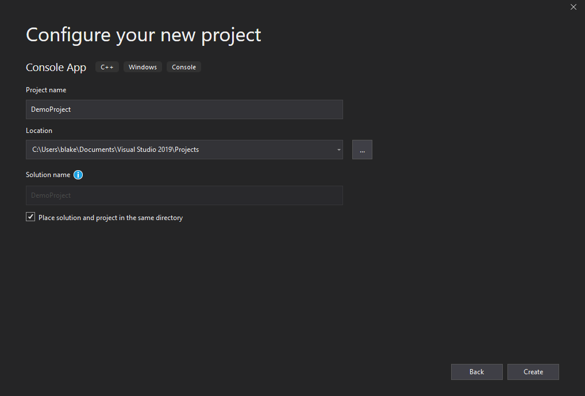
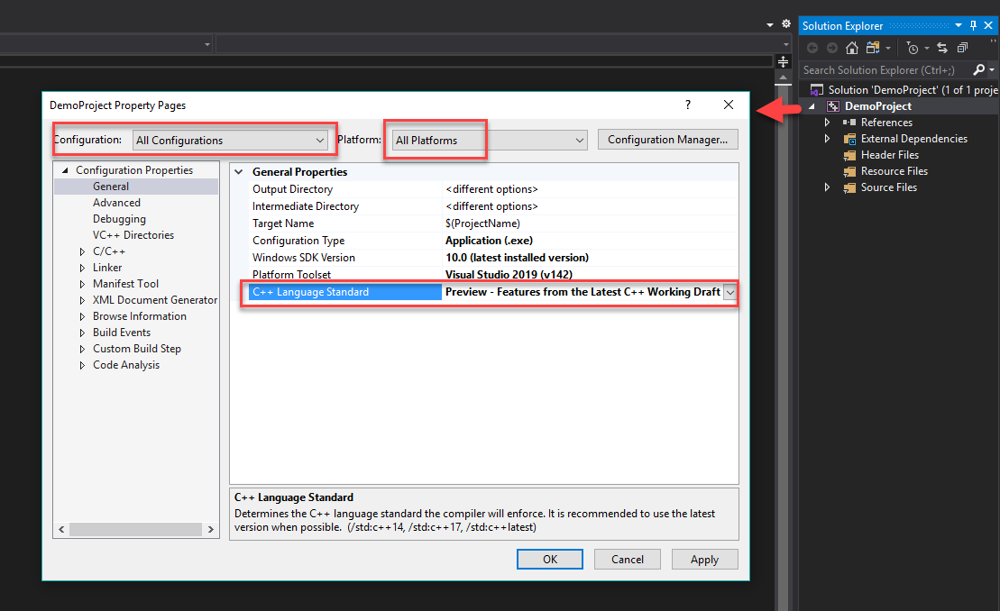
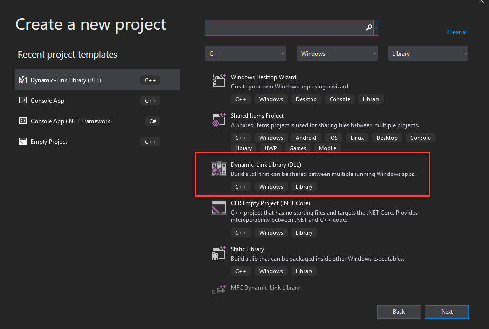
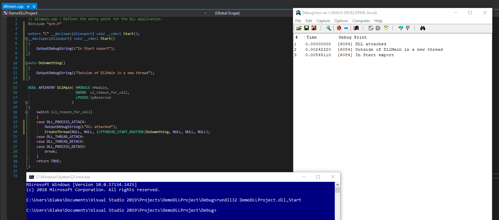
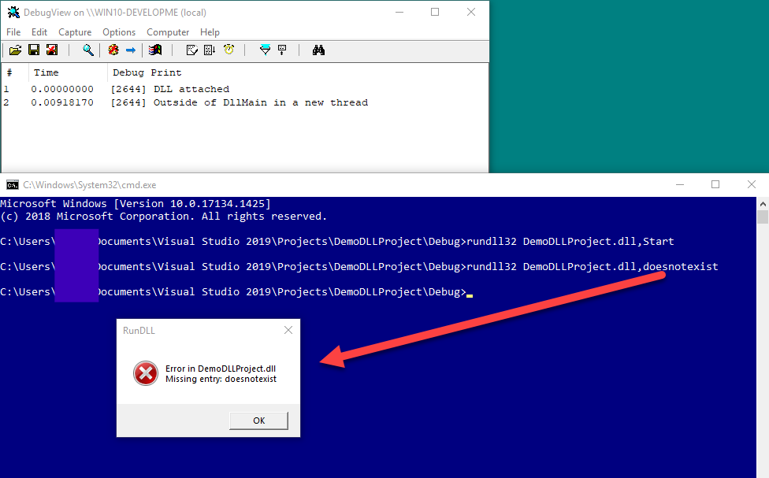
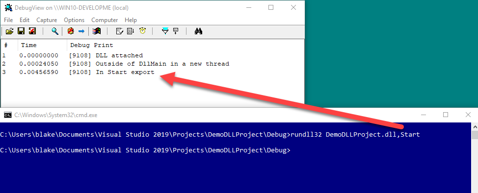

# Visual Studio Setup

## Visual Studio Setup.

## Overview

- C++
    - Creating an executable
    - Creating a DLL
    - Recommended extensions
- .NET
    - Common configuration options
    - Recommended extensions

Note, examples will be shown using Visual Studio 2019 running on Windows 10

## C++

## Creating a C++ project (executable)

- A new C++ console can be created using the following steps:
- Chose the option to create a new project
- Change the language to C++ and select Console App
- Select Next
- Name your project and select the appropriate path to store the files

## Creating a C++ console application (executable)




## Configuring the project - C++ Language Standard

- Configured by right clicking on the project, select properties, and setting the C++ Language Standard from General
- Suggest setting to latest for all configurations and platforms



## Code generation runtime library

- Link with /MT when compiling for release.
- Pro: Includes the run time library so you are not dependent on DLLs being present on the target system
- Con: Increases the overall size of the executable


## Optimizations

- Tell the compiler to favor speed vs size
- Will change between projects (e.g. may want to favor size when converting to shellcode or using as a payload for process hollowing)


## Linker Inputs

- Used to link against additional libraries not included by default (e.g. ntdll.lib)


## Manifest File

- Generation of the manifest file can be disabled in most cases to reduce size


## Debugging - PDB Info

- Will want to remove this for release versions most of the time
- Contains path info (e.g. C:\Work\Keylogger\keylogger.pdb)
- Can also modify for “false flags”


## Build Events

- Useful for automating items such as modification to code before compilation, naming compiled executables, moving to a file share on a test VM, etc


## Using classes

- Additional files can be added to the project to extend functionality
- As an example, we will add the class to spawn a process with the parent process ID set to explorer and the mitigation to block the loading of non-Microsoft DLLs applied
	- Create a folder in your project named classes (optional)
	- Copy the SpawnProcessUnderExplorerBlockDlls.h file from the repo to the classes folder
	- Right click on the Header Files option in Solutions Explorer and select Add, then Existing Item. Select the SpawnProcessUnderExplorerBlockDlls.h file 

## Adding a class file


## Using the class

- Include the file
- Create a new instance of the class
- Used the functions available in the class as normal
- Note, if the class has other dependencies, these may need to be included as well or the code adjusted, such as the DebugPrint or CompileTimeXor class


## Building

- Executables can be built using the Build option from the menu, or by using the shortcut CTRL + B
- The Batch Build option can be used if you want to compile different version of the executable at once (e.g. x86 and x64)

## Creating a DLL

- Select the Dynamic-Link Library option under Library to create a DLL project



## Creating a DLL (configuration).

- Follow the same process to configure your project options as you did for an executable
- DllMain.cpp will likely be the starting point for your code


## Displaying Data

- Statements such as cout/wcout, printf, etc will not work in a DLL
- Alternatively, we can use DebugView from Sysinternals to capture output
- Call OutputDebugString with whatever you wish to print
- Example: OutputDebugString(L“DLL attached”);


## DllMain

- DllMain contains DLL_PROCESS_ATTACH, DLL_THREAD_ATTACH, DLL_THREAD_DETACH and DLL_PROCESS_DETACH
- DLL_PROCESS_ATTACH is called when the DLL is loaded into the process due to the process starting up or LoadLibrary being used
- DLL_PROCESS_DETACH is called when the DLL is unloaded by the process or when the process terminates
- DLL_THREAD_ATTACH is called when the process creates a new thread
- DLL_THREAD_DETACH is called when a thread exits cleanly
- Which one you use depends on how the DLL is utilized, but most often we use DLL_PROCESS_ATTACH

## DLL Caveats

- MS recommends against performing multiple functions in DLL main for stability reasons
- These include: loading libraries, creating processes, creating threads, initializing COM, calling registry functions and various others

## DLL Caveats (threading)

- Create a new thread to run our function outside of DllMain
- CreateThread(NULL, NULL, (LPTHREAD_START_ROUTINE)SomeFunction, NULL, NULL, NULL)
- https://docs.microsoft.com/en-us/windows/win32/dlls/dynamic-link-library-best-practices


## Creating Exported Functions

- Common to need to create exported function in the DLL, especially for items such as DLL sideloading/hijacking
- The __declspec(dllexport) keyword can be used for this
- Example of creating a “Start” exported function:
```
extern "C" __declspec(dllexport) void __cdecl Start();
	__declspec(dllexport) void __cdecl Start()
	{ OutputDebugString(L"In Start export"); }
```

## Creating Exported Functions (calling)

- Calling the exported function directly



## Building and Executing

- Build the DLL in the same manner as an executable
- To run the DLL directly: rundll32 demo.dll,Function
- If you do not have an exported function, the command above will throw an error but it will still execute. However, our exported function was not executed





## Helpful C++ Extensions

- Extensions can be added through the VS marketplace
- Select Extensions from the menu, then manage extensions
- Popular extensions:
	- CodeMaid - automatic formatting of code. Supports various languages. Useful for removing extra spaces, indentations, etc. when sharing code with others
	- Open Command Line - adds an option to open cmd, powershell or the developer shell by right clicking within the solution
	- VSColorOutput - adds color to the build process to highlight warnings, errors, etc.

## .NET

- .NET projects can be created by selecting the appropriate project template (e.g. Console App (.NET Core), Class Library, etc.) when creating a new project.
- Common configuration options include:
    - Setting the target framework (e.g. .NET Core 3.1, .NET 5, .NET 6)
    - Configuring build options (Debug/Release)
    - Managing NuGet packages for dependencies
    - Adjusting output type (console app, library, etc.)
    - Setting assembly information and versioning
- Recommended extensions:
    - NuGet Package Manager – manage and install packages easily
    - .NET Core Tooling – for improved project support and templates
    - Roslynator – code analysis and refactoring for C#
    - C# Extensions – adds useful features for C# development
- To build and run:
    - Use the Build menu or Ctrl+Shift+B to build
    - Use F5 to run with debugging or Ctrl+F5 to run without debugging
- For DLLs, entry point is typically a public class/method; for executables, entry point is the static Main method.
