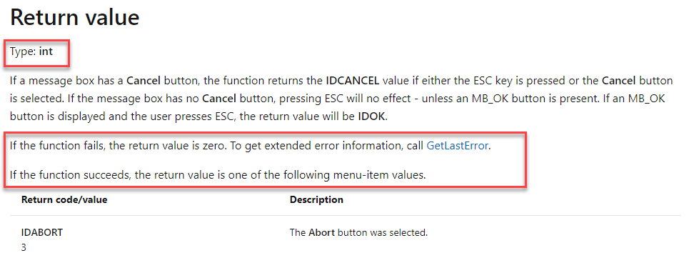
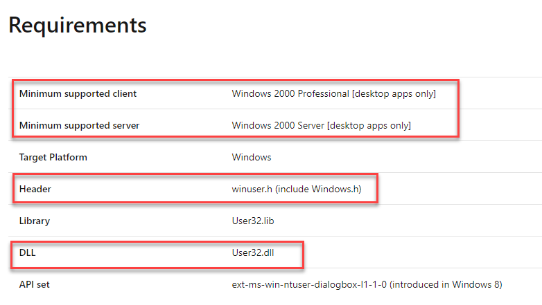
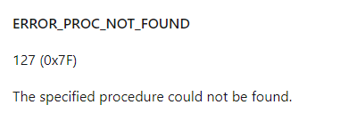
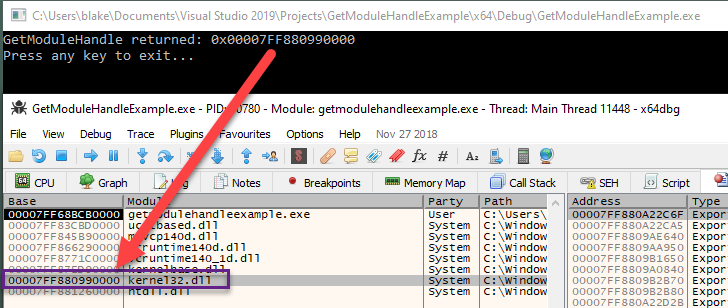
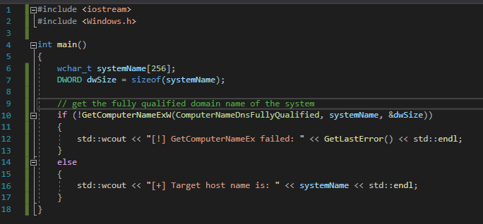
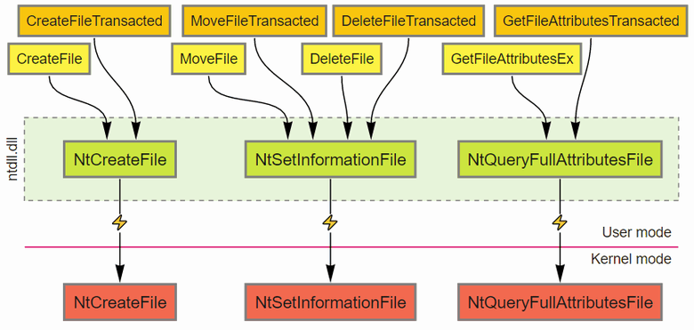

# Windows API

## Slide 1

Windows API

Working with the Windows API/Functions

## Slide 2

Agenda

What is the Windows API
Reading the Documentation
GetLastError for Debugging
LoadLibrary
GetModuleHandle
GetProcAddress
Common Function Mapping
Retrieving the Hostname of a System
Exercise

**Speaker Notes:** Objective: General familiarity with the Windows APIs

## Slide 3

What is the API

“The Windows Application Programming Interface (API) is the system programming interface to the Windows operating system family” - Windows Internals, Fifth Edition
APIs are divided into categories such as Networking, Web Services, User Interface, Graphics, etc.
Most APIs are documented on MSDN and included code examples of usage
APIs are contained within various DLLs
Kernel32.dll - includes functions related to processes, threads, and memory management
User32.dll - functions for the user interface
GDI32.dll - graphics, images and display
Advapi32.dll - registry, object security and event logging functions
ComDlg32.dll - dialog boxes
ComCtl32.dll - window controls

## Slide 4

Reading the Documentation

Information on how to call the function, the expected return values on success and failure, the header to include, and the containing DLL are often listed

## Slide 5

Ascii and Unicode 

APIs that deal with character manipulation are implemented in the following ways:
An ANSI version, denoted by the letter “A” (e.g. LoadLibraryA)
An unicode version denoted by the letter “W” (e.g. LoadLibraryW)
A generic version that are mapped during the preprocessing stage to one of the above (e.g. LoadLibrary)
Unicode is the preferred character encoding
Calling the ANSI version will eventually result in the OS calling the unicode version internally

**Speaker Notes:** Reference: https://docs.microsoft.com/en-us/windows/win32/learnwin32/working-with-strings

## Slide 6

GetLastError For Debugging

Useful for debugging and error handling
Gets the last error code from the calling thread
Error codes can be referenced to determine why the failure occurred

## Slide 7

LoadLibrary

Loads a specified module into the address space of the calling process
Takes the name of the module to load and returns the virtual address where the module is mapped
LoadLibrary process flow:
Acquires a lock which will be released when the process flow is completed
Checks if the module is already loaded by traversing the Process Environment Block (PEB)
Locates the module on disk
Maps the module into memory
Updates the PEB with an entry for the module
Walks the import list to see if any dependent libraries need to be mapped
Updates the associated reference count
Commonly used in malware for DLL injection and dynamically finding the address of functions/APIs

**Speaker Notes:** Reference: https://docs.microsoft.com/en-us/windows/win32/api/libloaderapi/nf-libloaderapi-loadlibraryw

## Slide 8

LoadLibrary

Example of loading user32.dll via LoadLibrary. Note the base address of user32.dll is returned

## Slide 9

GetModuleHandle

MSDN: Retrieves a module handle for the specified module. The module must have been loaded by the calling process
Takes the name of the module and returns the base virtual address of specified module
If the process fails, the return value is null
Example of usage in malware include dynamically resolving functions and modifying code for specific locations/functions

## Slide 10

GetModuleHandle

Example of getting the base address of kernel32.dll via GetModuleHandle

## Slide 11

GetProcAddress

Per MSDN: Retrieves the address of an exported function or variable from the specified dynamic-link library (DLL)
The exported function can be the name or an ordinal value
Example usage in malware includes dynamically resolving the address of specific functions

## Slide 12

GetProcAddress

Finding the address of VirtualAllocEx in kernel32 using GetProcAddress

## Slide 13

Common Function Mapping

The table below outlines some common actions and the corresponding functions
There are often multiple functions for the same action that can be used

## Slide 14

Retrieving the Hostname of a System 

Example of using the GetComputerNameExW function to get the hostname 

## Slide 15

NTDLL

NTDLL is loaded into the address space of every application
Provides the lowest level functionality in user space before the transition to the kernel
Exported functions often have the prefix Nt and/or Zw (e.g. NtCreateFile)
The functions may be documented by Microsoft but many are not. They are also subject to change
Malware will commonly call or alter hooks placed on specific functions in ntdll directly in an attempt to evade anti-virus and EDR products

## Slide 16

NTDLL

Windows APIs, such as CreateFile from kernel32.dll, are forwarded to ntdll.dll, which then transition to the Windows kernel

**Speaker Notes:** Image reference: https://habr.com/en/post/485788/

## Slide 17

Exercise

Create a tool to perform reconnaissance of the target system
At a minimum, obtain the hostname, current user account and IP address information
APIs / functions to consider:
GetComputerNameEx
GetUserNameEx
GetAdaptersAddresses
Use the language of your choice

